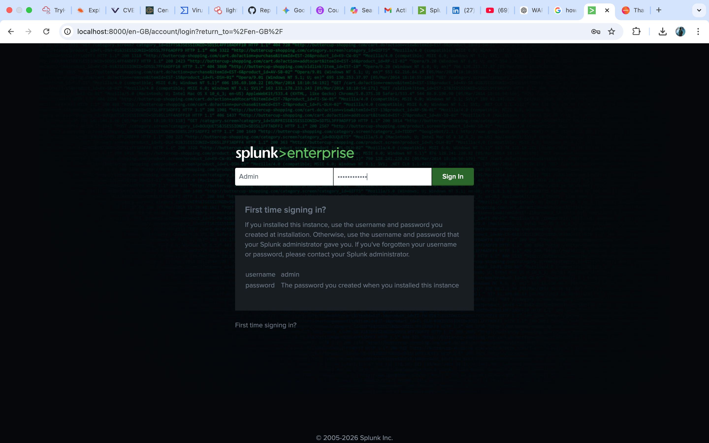
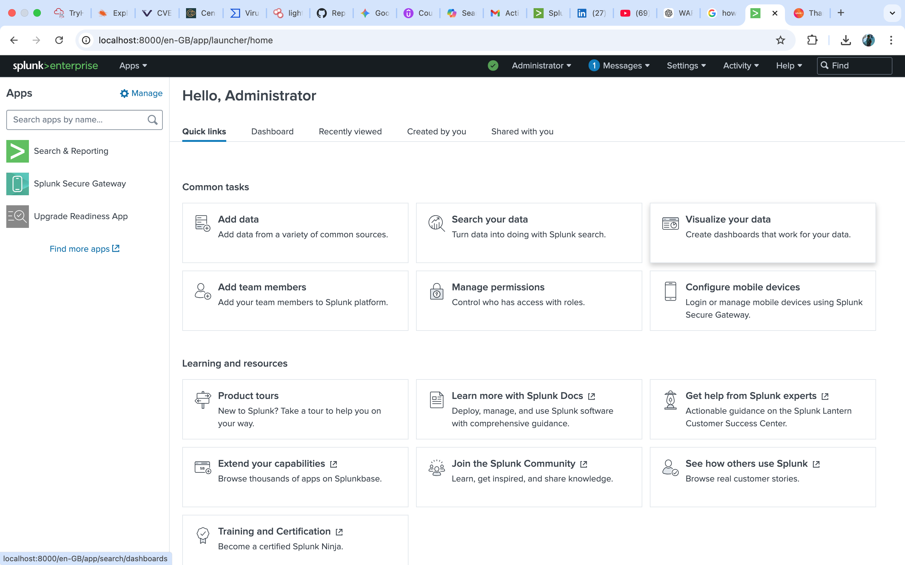
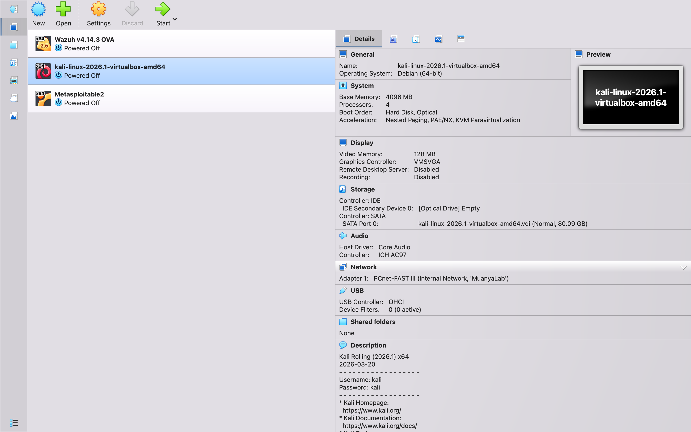
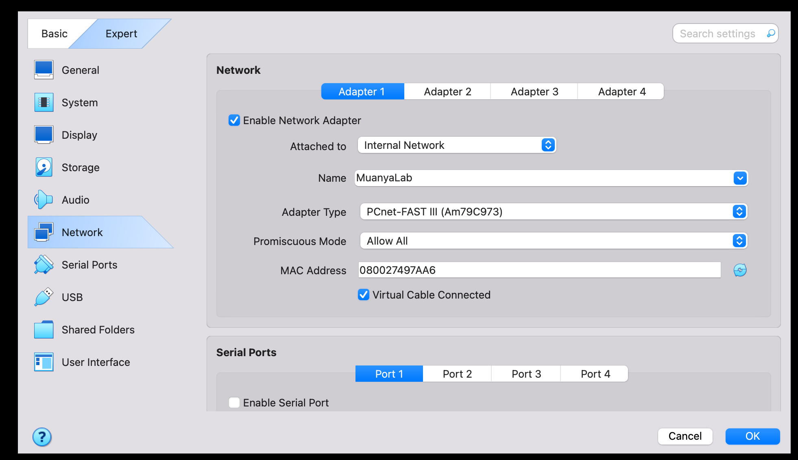

# P1: ENVIRONMENT/LAB SETUP | MAY 6

> This page documents the initial buildout of my Home SOC Lab, including Splunk installation and a VirtualBox three-VM cyber range setup.

## Phase 1: SPLUNK INSTALLATION

### **1. Date & Time**

May 6, 2026 | 5:00am - 7:00am

### **2. The Problem**

Splunk Enterprise 10.1 failed to install on macOS Monterey 2015 due to compatibility issue.

### **3. The Action I Took**

Researched Splunk version compatibility for macOS 2015
• Downloaded Splunk Enterprise 9.1 instead
• Installed via Terminal using: ./splunk start
• Verified by accessing [http://localhost:8000](http://localhost:8000/)

### **4. The Result**

Successfully logged into Splunk Enterprise 9.1 web interface. Screenshot attached below.

`Figure 1: Splunk Enterprise 9.1 first time login at http://localhost:8000`

`Figure 2: Splunk Enterprise 9.1 Administrator Dashboard- Successful login confirmed`

### **5. What I Learnt**

SOC Analysts spend 80% of time troubleshooting. CLI is faster than GUI for legacy systems.

### **6. Next Step**

Load Boss of SOC dataset and run first search query tomorrow.

May 6, 2026 | 5:00am - 7:00am

## Phase 2: SETTING UP A VIRTUALBOX CYBER RANGE

**Date: May 6, 2026 | 7:00am - 9:00am**

**2.1 The Goal**
Build isolated 3-VM home SOC lab for Red vs Blue practice.

**2.2 The Architecture**

- Kali Linux 2026.1 (Attack Machine) - 4GB RAM, 4 CPUs
- Wazuh v14.3 OVA (Blue Team SIEM) - 8GB RAM, 4 CPUs
- Metasploitable2 (Victim Machine) - 2GB RAM, 2 CPUs
- Internal Network: MuanyaLab (Isolated from internet)

**2.3 The Action I Took**

- Downloaded Kali Linux ISO + Wazuh OVA + Metasploitable2 OVA
- Created Internal Network "MuanyaLab" in VirtualBox
- Configured 3 VMs with static RAM/CPU allocation

**2.4 The Result
All 3 VMs configured and ready. Screenshot attached below.**

2.5 What I Learned
Network isolation contains malware within the lab environment and prevents lateral movement to the host machine or home network.

2.6 Next Step
Power on Wazuh OVA and access [https://localhost:443](https://localhost/) for SIEM setup.
