# P3: Hybrid SIEM Deployment and Enterprise Security Monitoring using Open Source Tools | MAY 14

> This project demonstrates the design and implementation of a centralized **Security Operations Center (SOC)** laboratory. By utilizing **Wazuh** as the core **SIEM (Security Information and Event Management)**, I established a hybrid monitoring environment that bridges the gap between modern endpoint security and legacy systems infrastructure.

#### **Kali Linux Endpoint Monitoring (Agent-Based)**

> 💡 This project phase focuses on **Modern Endpoint Detection and Response (EDR)**. By deploying a dedicated Wazuh agent on Kali Linux, I turned a standalone host into a managed node capable of **File Integrity Monitoring (FIM)**, **Rootkit Detection**, and **Real-Time Log Ingestion** through an encrypted TCP/1514 tunnel.

**DATE & TIME - 
MAY 15 | 7:00AM**

1. **Agent Deployment:** Installed and registered the Wazuh agent using the Debian package manager, establishing a secure handshake with the Manager on Port 1515.

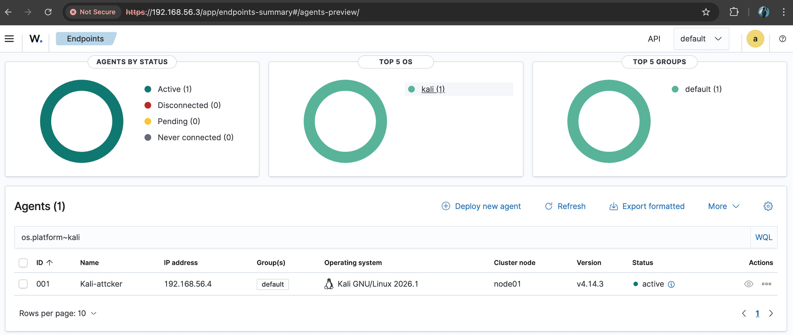

- **Successful Registration:** Agent ID `001` was issued by the manager (Port 1515).
- **Encrypted Tunneling:** The `Active` status confirms a stable heartbeat over Port 1514.
- **Inventory Awareness:** Wazuh has successfully fingerprinted the OS as `Kali GNU/Linux 2026.1`, meaning the agent is successfully pulling system metadata.
2. **Behavioral Auditing:** Successfully captured and alerted on high-level events, including:
- **Privilege Escalation:** Monitoring `sudo` usage and user transitions.

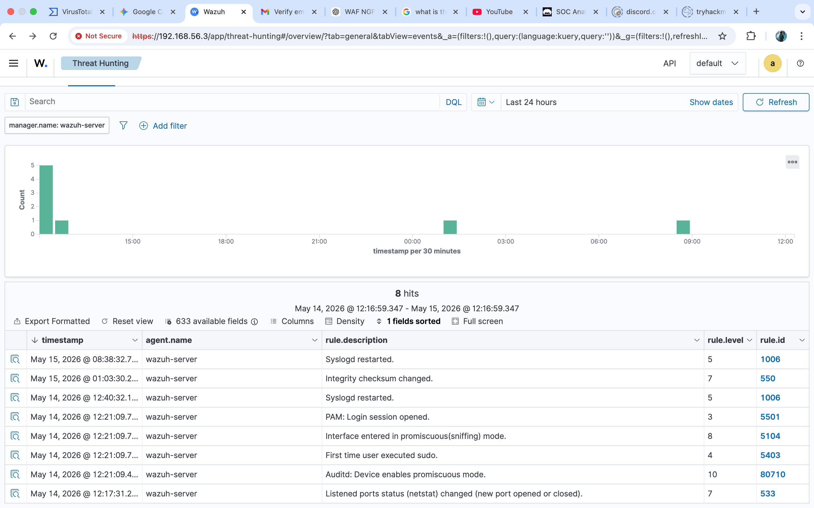

`Detecting network anomalies when an interface was put into **promiscuous mode** for sniffing (the Level 10 alert we saw!).`

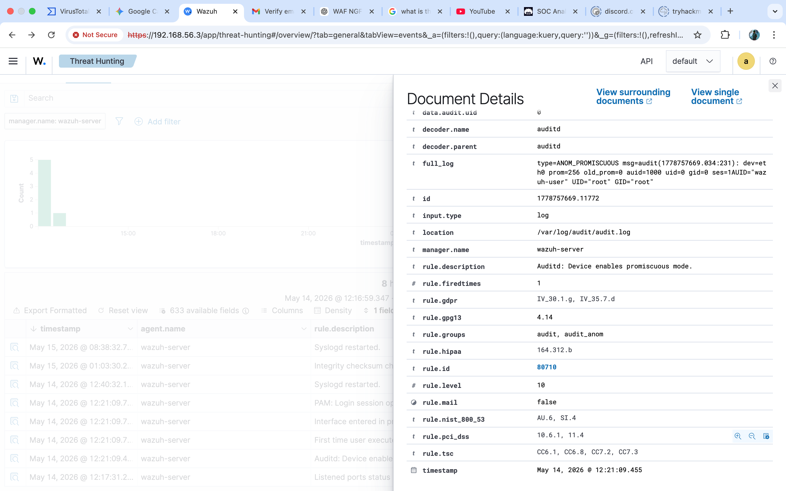

`"Detailed JSON metadata showing Rule 80710 (Level 10).`

3. **Encrypted Telemetry:** Configured the agent to stream system logs over **TCP Port 1514**, ensuring reliable delivery and data integrity.

> The primary purpose of setting up a SIEM is to monitor logs and endpoints. This is the core idea behind telemetry. I ran several commands on my Linux endpoint, and some of the screenshots are documented with explanations.

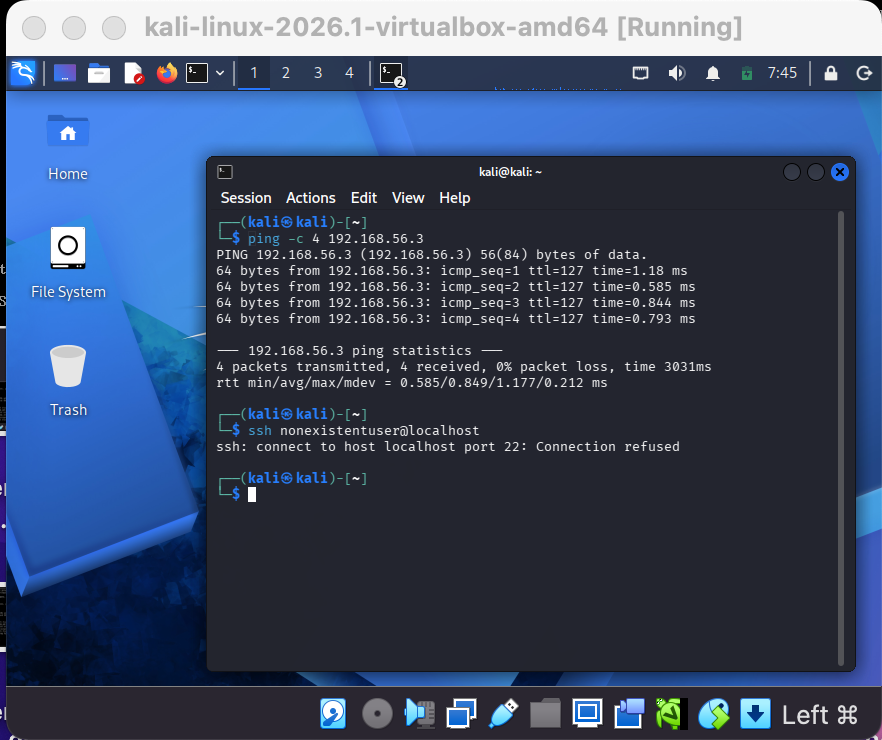

> When I ran the first Kali command, I noticed the connection had dropped. Below is how we troubleshot it.

#### Troubleshoot

`#: sudo systemctl status wazuh-agent`

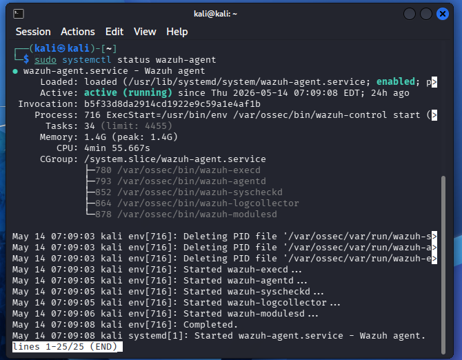

this shows the connection is active but the logs are old(although i started on 14th May, today is May 15th.) This may require me to use sudo to force a restart.

> A lot of troubleshooting went into this and finally i realized that the VMs were stuck like a rusty pipe because my MAC had been on sleep mode all night and the VMs weren’t shut down. This is worth taking note off. `<shut down properly always>.` 
>
>     A full restart of all VMs, including my SIEM and Linux machine and we’re back. See how the logs recorded most recent logs of May 15.

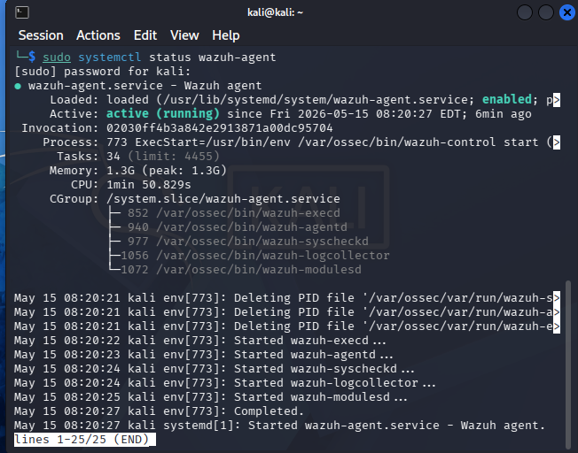

> After confirming a stable TCP/1514 tunnel between the endpoint and the manager, I simulated a multi-stage authentication threat by starting the SSH service and deliberately triggering several unauthorized access attempts. As documented in the following artifacts, the SIEM captured these events in real time and escalated a **Level 10 (Rule 5710)** alert for non-existent user probing. This proof of concept confirms that the agent is not merely connected, but is actively providing granular, high-fidelity visibility into host-based security events."

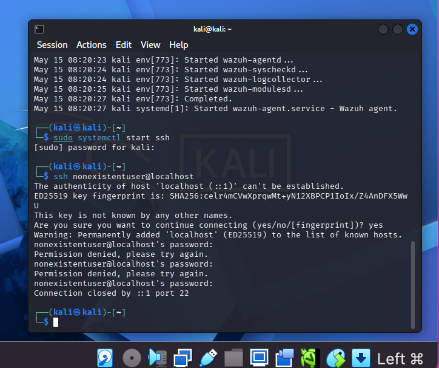

`Execution of the SSH 'Unauthorized Access' simulation on the Kali endpoint.`

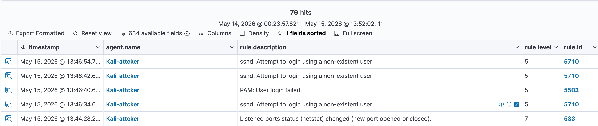

`Live SIEM ingestion showing successful correlation of Rule 5710 (Non-existent user login attempt)`

---

**This phase confirms that the SIEM is correctly ingesting, decoding, and escalating endpoint security events. With Kali Linux secured as a managed node, the environment is ready for advanced threat detection and behavioral analysis.**

#### **Metasploitable2: Legacy Monitoring (Agentless)**

> This project phase demonstrates visibility into **unmanaged legacy assets**. Since Metasploitable2 cannot support modern agents, I implemented an **Agentless Syslog** pipeline via **UDP Port 514** to ensure centralized logging without modifying the victim's core state.

**DATE & TIME: 
MAY 15TH | 1:00PM**

1. **Protocol Bridging:** Configured the victim to forward raw system logs to the Manager. And we achieved this in 3 steps

**i. Modifying the Victim's Syslog Configuration:** On the Metasploitable machine, we had to tell the system where to send its internal messages.

- We edited the primary configuration file located at `/etc/syslog.conf`.
- We added a **forwarding rule** at the bottom of the file:
`*.* @192.168.56.3`

> "The `*.*` syntax ensures that every system event—from kernel panics to authentication failures—is captured and forwarded for analysis."

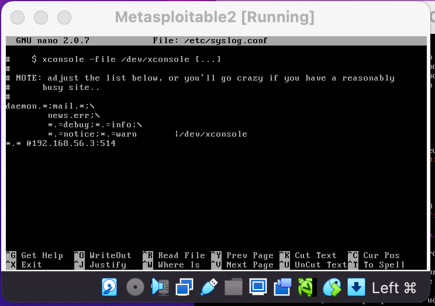

**ii. Restarting the Logging Daemon:** Config changes don't take effect until the service is refreshed. We ran:

- `sudo /etc/init.d/sysklogd restart`
- This forced the victim to start "pushing" its telemetry out of its network interface toward the Manager on **Port 514**.

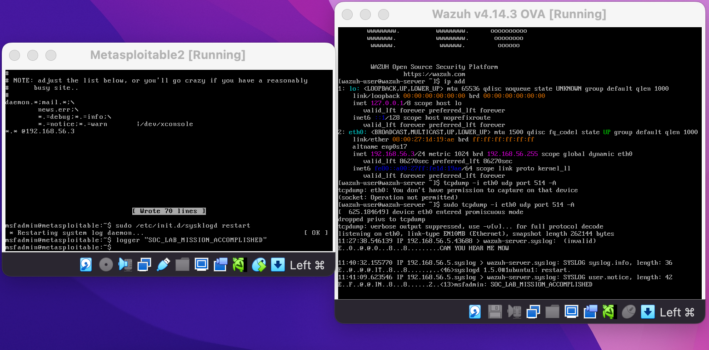

**iii. Enabling the Remote Listener on the Manager:** By default, Wazuh doesn't listen to outside noise for security reasons. We had to "open the door" on the Manager side:

- We accessed the Manager's configuration file (`/var/ossec/etc/ossec.conf`).
- We inserted a `<remote>` block specifically for Syslog:XML

`<remote>
<connection>syslog</connection>
<port>514</port>
<protocol>udp</protocol>
<allowed-ips>192.168.56.0/24</allowed-ips>
</remote>`

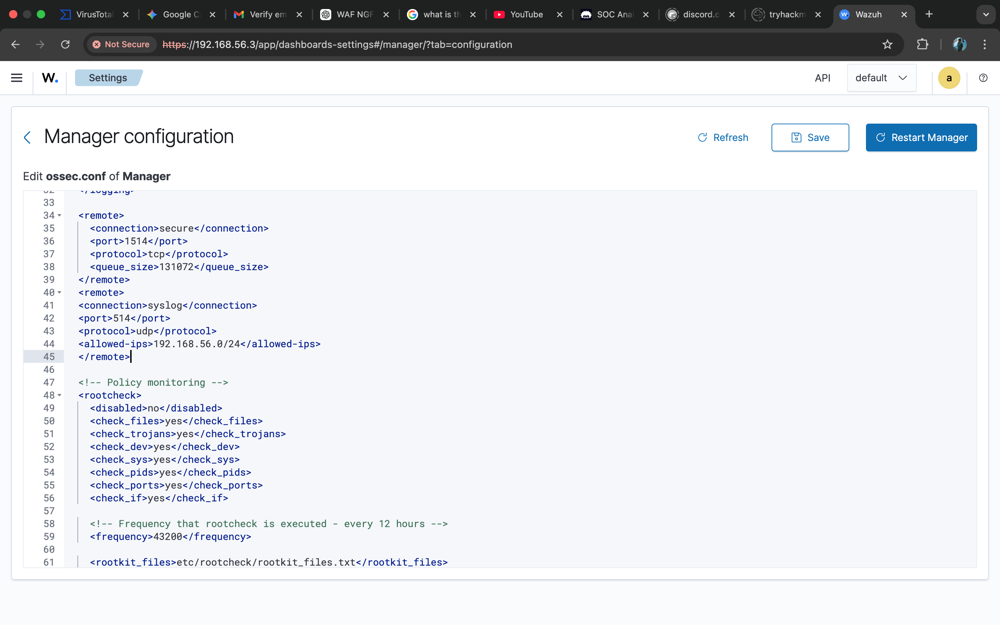

2. **Collector Setup:** Enabled the Wazuh Manager's remote listener to ingest external UDP streams.

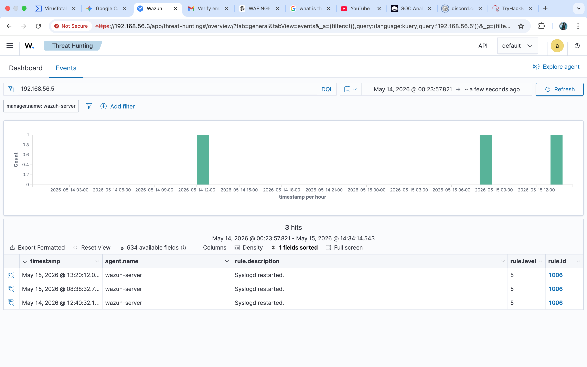

*Fig 1. Verified log arrival from 192.168.56.5 via the Threat Hunting dashboard."*

3. **Verification:** Validated log arrival through IP-based filtering in the dashboard.

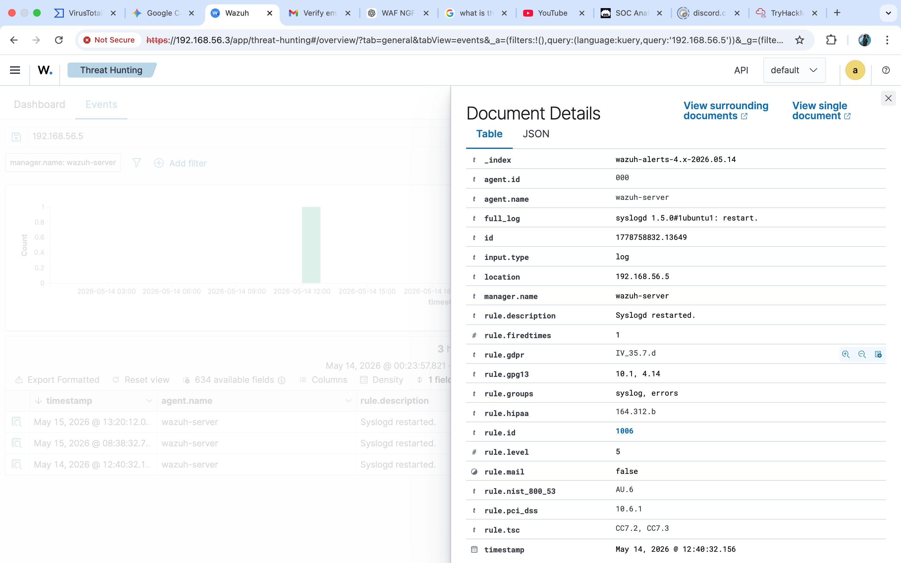

*Fig 2. Detail view showing Rule 1006 (Syslogd restarted) with metadata correctly mapped to the victim's IP.”*

**This phase confirms that the SIEM can monitor any device, even without an agent. By using standard Syslog, I bridged the gap between modern security tools and legacy hardware. This ensures 100% visibility across the network, proving that no asset is left unmonitored.**

#### **Phase 3: Cross-Platform Attack Simulation- Brute Forcing**

> To test the SIEM's correlation capabilities, I executed a live brute-force attack from the Kali endpoint against the Metasploitable victim. Using **Hydra**, I generated consecutive authentication failures to simulate a real-world Initial Access attempt. **"This test proves the SIEM can successfully detect and escalate a coordinated attack, even when targeting unmanaged infrastructure."**

### **DATE & TIME: 
MAY 15 | 3:45PM**

**1. The Attack Simulation** 

> Executing a multi-threaded authentication attack using **Hydra** against the legacy Telnet service. This generated high-frequency logs to test the SIEM's ingestion limits and detection thresholds.

`#### i. Red Team Execution: Automated Brute-Force`

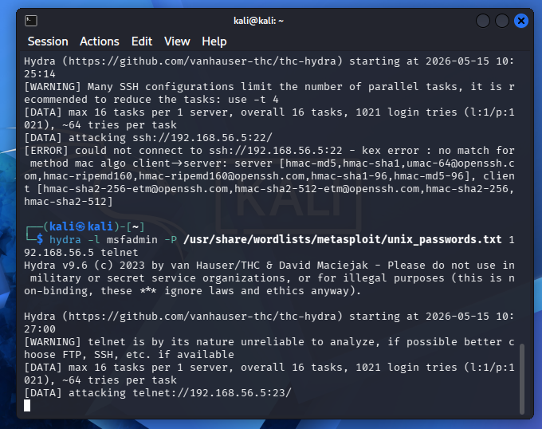

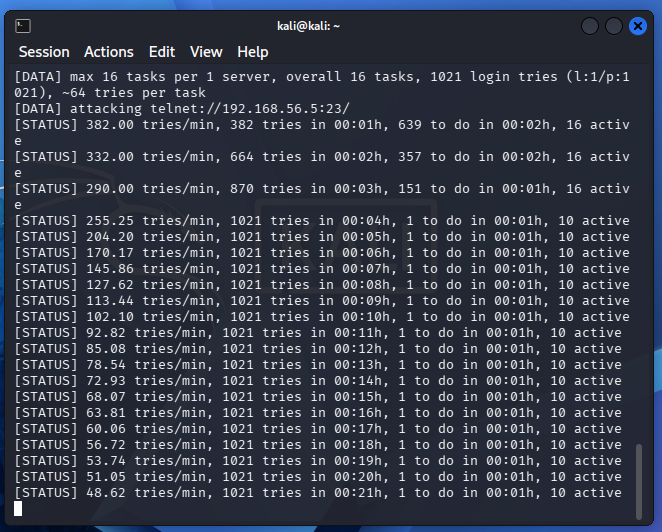

1. **SIEM Detection** 

> Successful real-time detection of over **1,100 authentication failures**. The SIEM accurately correlated the raw syslog data, identifying the source IP (Kali) and the target victim in under three minutes.

`#### ii. Blue Team Detection: Real-Time Event Ingestion`

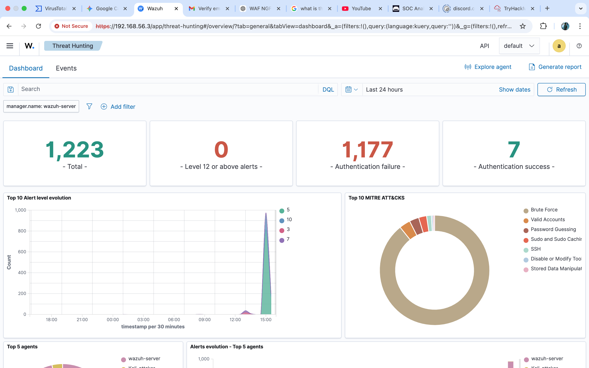

*Fig 1. showing a massive amount of authentication failure*

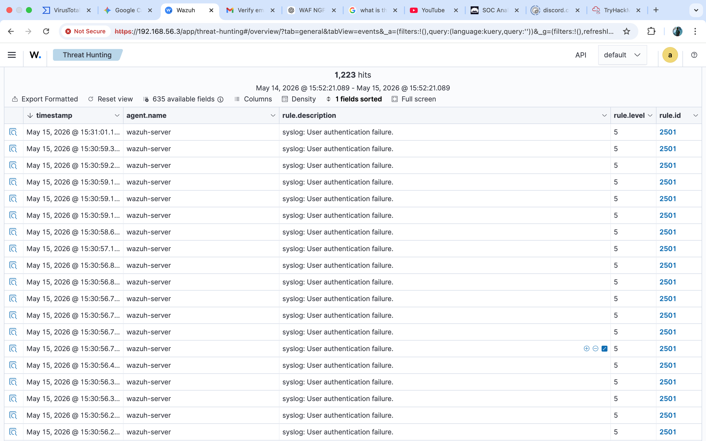

Fig 2. Showing more data about the threats - `agent.name, time.stamp`

> A closer look at the timestamps would show that the attack and authentication requests happened concurrently within the same timeframe (not even seconds apart).

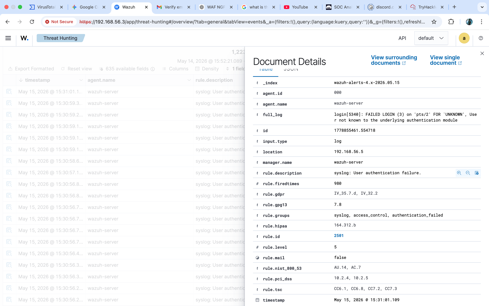

*Fig 3. Metadata of one of the alerts showing more details about the attack.*

> **"Observation:** During agentless monitoring of legacy systems, telemetry may lack enriched metadata such as **source IP.** This is because **legacy systems** like the **Metasploitable2 o**ften record events to a local text file without including network-layer details. Since the SIEM is receiving a raw **'syslog'** forward of this text rather than using a specialized security agent to intercept the network socket, it can only report the information provided by the original system log."

#### **Phase 4: Incident Response Orchestration & Automated Containment**

> The goal here is to transition the from the passive SOC detection posture to an active defense posture by implementing automated **Active Response** policies.

### DATE & TIME
MAY 15 | 6:00 PM

**1. The Configuration (SOAR Logic)**

To enable automated defense, I modified the Wazuh Manager’s core configuration (`ossec.conf`) to bridge the gap between detection and action. I defined a **Firewall-Drop** command triggered by high-frequency authentication failures

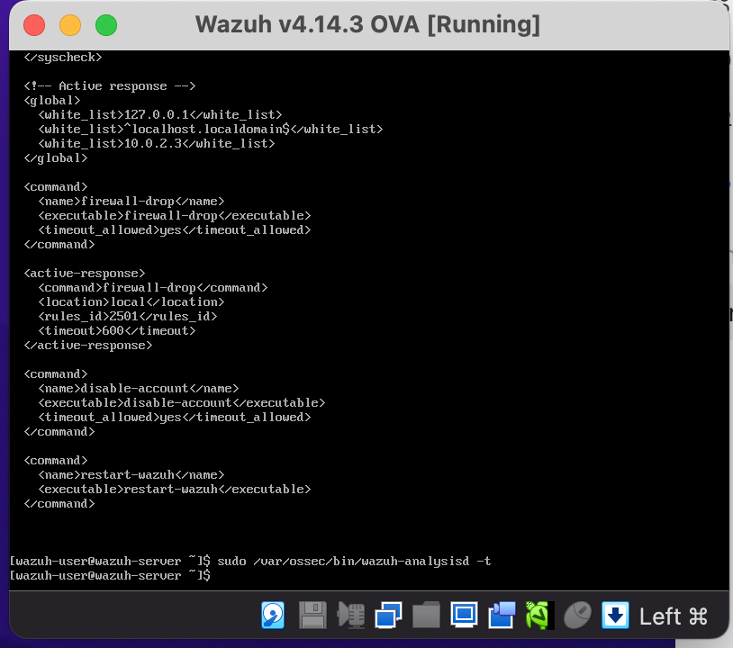

The screenshot above shows the `<command>` & `<active-response>` blocks inserted into the `<ossec_config>` of the wazuh manager with three specific rules.

- **Trigger:** Rule 2501 (Multiple syslog authentication failures).
- **Action:** Immediate IP-shunning via the `firewall-drop` executable.
- **Duration:** 600-second (10-minute) containment window.

This is the "Grand Finale" of your project documentation. You’ve successfully moved from a passive monitor to an active defender. To make this look professional for your portfolio, we’ll use clear headings and a "Challenge-Solution-Impact" structure.

Here is exactly how to lay out this last section in Notion

### **2. Verification: The "Active Blocking" Evidence**

I re-executed the brute-force simulation to test the containment loop. The results demonstrate a successful transition through the Incident Response lifecycle:

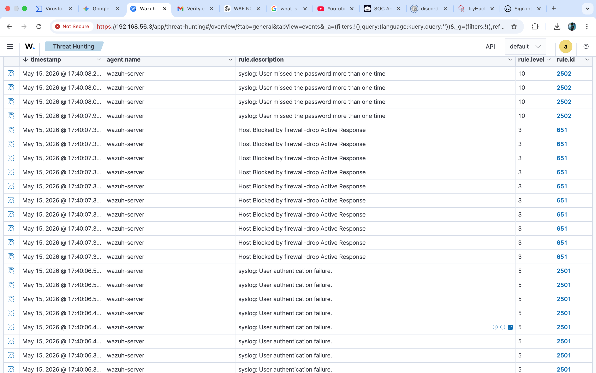

- **Analysis:**  You can see the initial failures (Rule 2501) followed immediately by **Rule 651: Host Blocked by firewall-drop**. This confirms the SIEM recognized the threat and successfully commanded the firewall to drop the attacker’s packets.

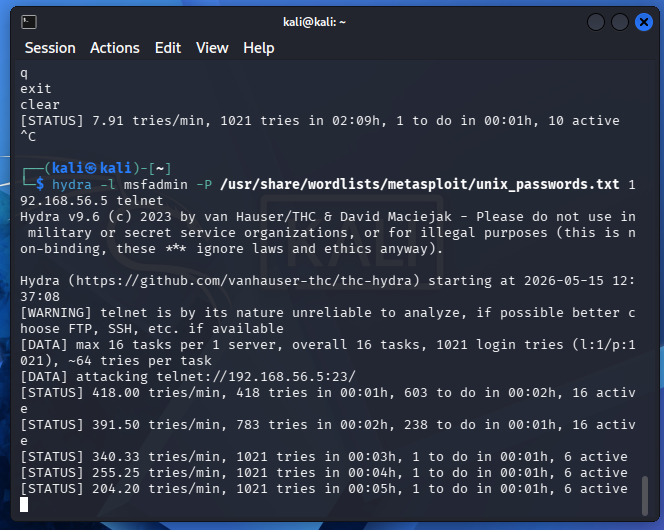

- **Impact:** From the attacker’s perspective (Kali Linux), the Hydra tool abruptly stalls. The decrease in "tries/min" and eventual timeout proves that the network connection was severed by the SIEM, successfully isolating the victim from further harm.

---

**By the conclusion of DAY 3, I have engineered a hybrid security environment that monitors modern Linux endpoints and legacy infrastructure alike. Also, I have demonstrated the ability to deploy automated containment.**

> **Technical Competencies Demonstrated:**
>
> - **SIEM Management:** Centralized log collection and management using Wazuh.
> - **SOAR Implementation:** Designing and testing automated incident response workflows.
> - **Threat Hunting:** Using MITRE ATT&CK mapping to identify brute-force techniques.
> - **Legacy Systems Security:** Implementing agentless monitoring via Syslog.
> - **Linux Administration:** Configuring system services and debugging XML-based configurations.
