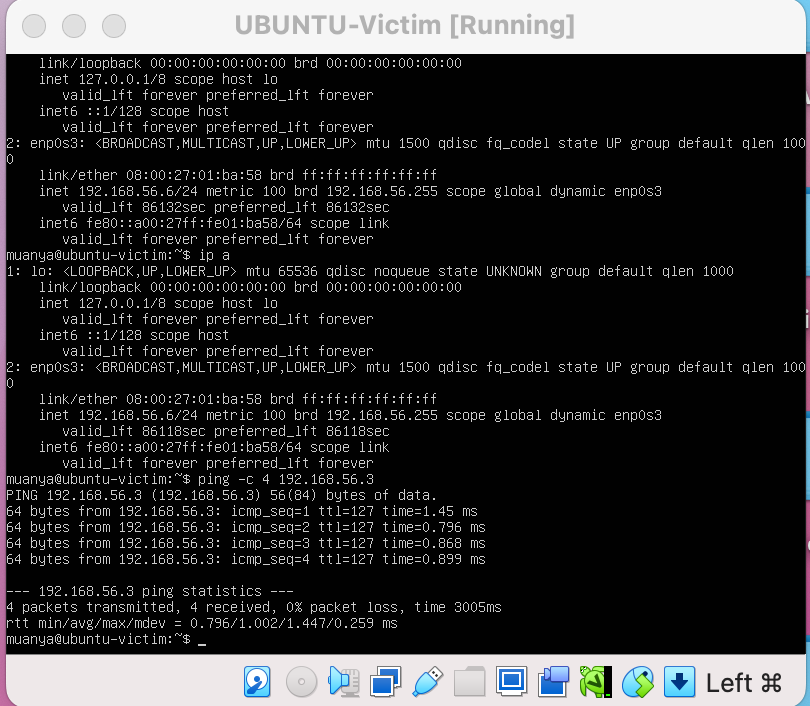
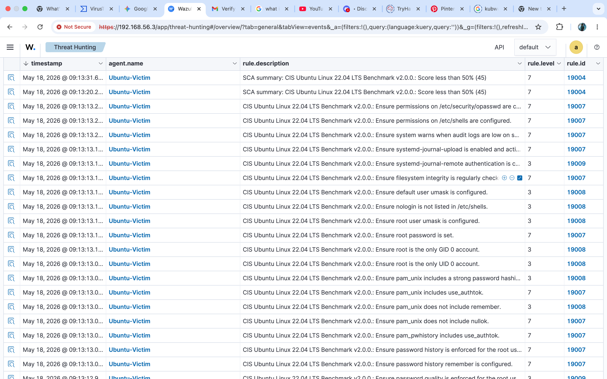
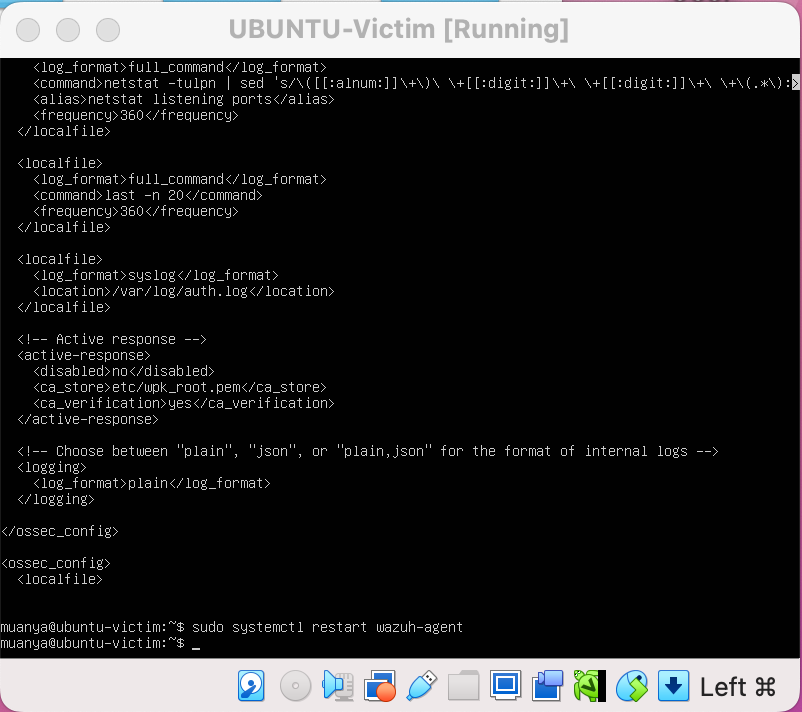
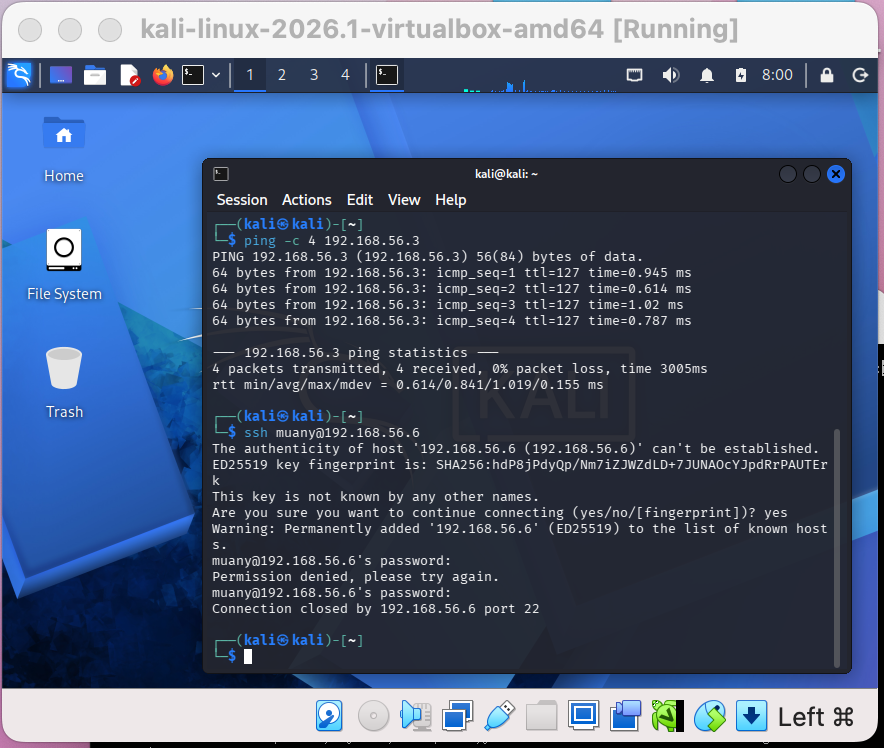
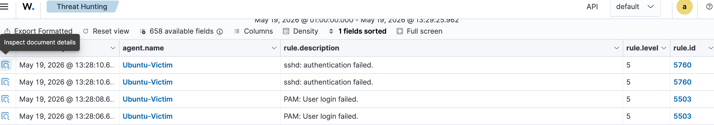
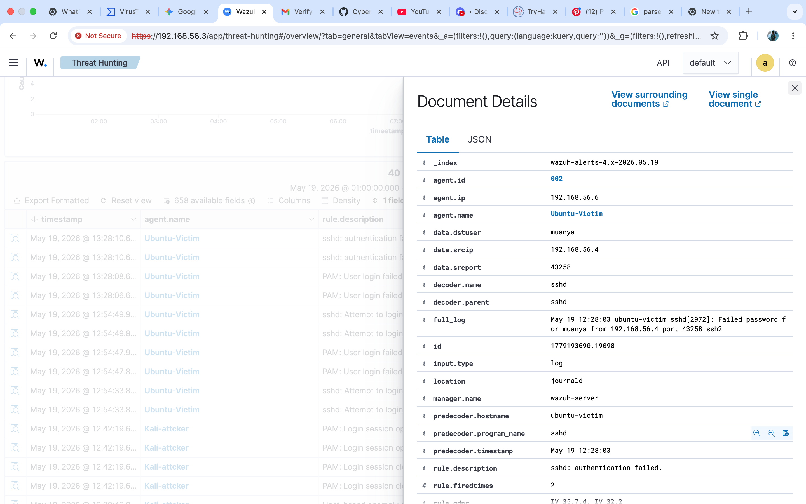
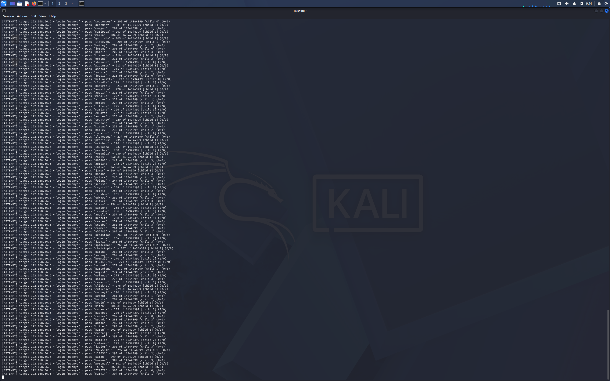
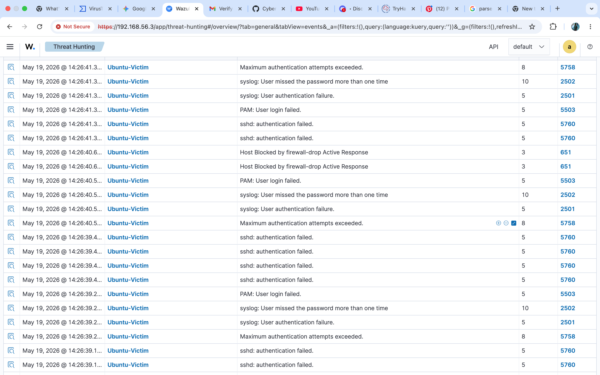
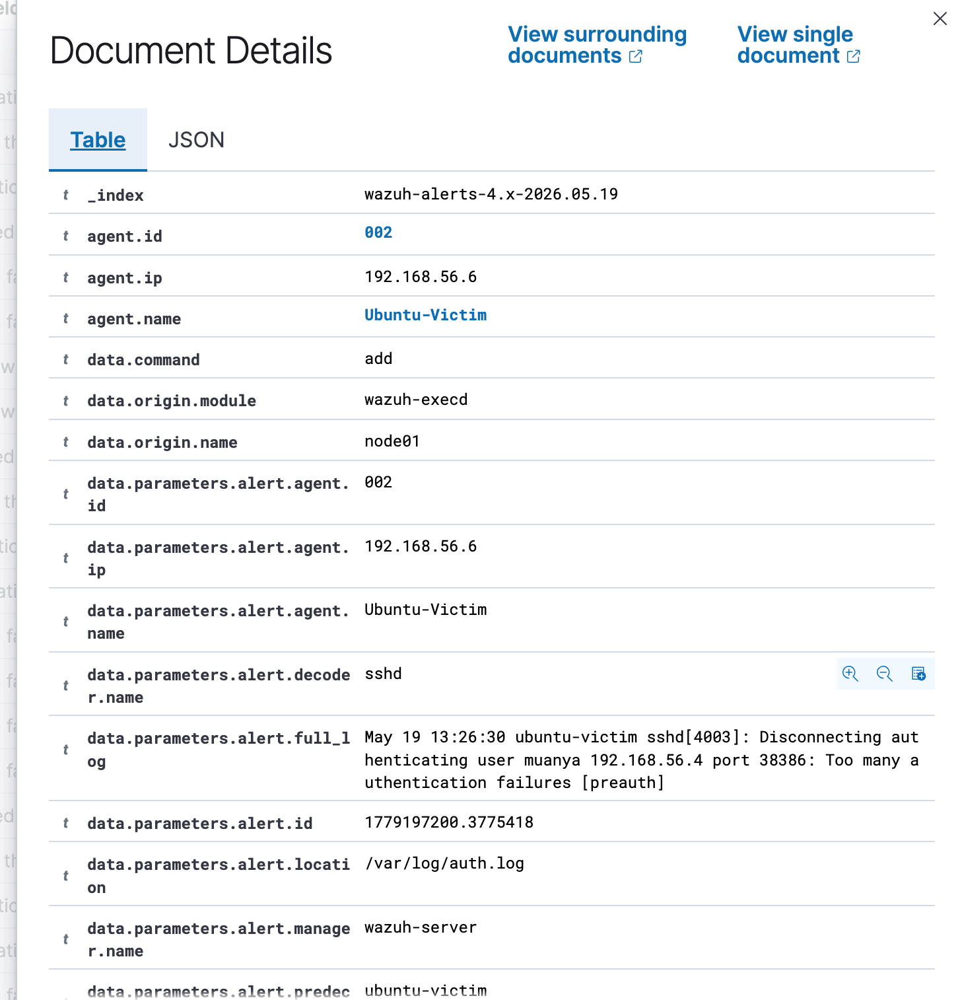

# P4: Threat Detection Engineering: Upgrading from Syslog to EDR Telemetry in a Sandboxed Cyber Range | MAY 18

> This project demonstrates the design, deployment, and configuration of an isolated security operations sandbox used to analyze brute-force attack vectors. The core objective of this engineering cycle was to pivot from basic, network syslog aggregation to deep, endpoint-level telemetry.
>
> By deploying a dedicated Wazuh EDR (Endpoint Detection and Response) agent on an enterprise Ubuntu Server target, this configuration successfully bridges the visibility gaps inherent in standard log forwarding, providing full process auditing, file integrity monitoring, and granular metadata collection required for modern incident response.

## The Reason why i pivoted from Metasploitable to Ubuntu 22.04(victim)

### The Limitations of Metasploitable & Standard Syslog

In the initial phase of building this security range, **Metasploitable2** was integrated using **agentless syslog monitoring**. While syslog successfully captures basic system events, it introduces massive structural limitations for a high-fidelity Security Operations Center (SOC) environment:

1. **Lack of Rich Metadata:** Standard syslog messages often lack the granular environmental context—such as parent-child process trees, cryptographic file hashes, and specific user session identifiers—necessary to reconstruct a sophisticated attack path.
2. **Telemetry Blind Spots:** Agentless monitoring relies purely on what the legacy operating system is willing to broadcast over network protocols. If an attacker tampers with local log files or uses specialized evasion techniques, the central SIEM remains blind to the host's internal state.

> Basically, i wasn’t able to properly triage  because i wasn’t getting the source IP of the attack and couldn’t enough data for investigation.

---

### The Engineering Solution: Purpose-Built Ubuntu Target with EDR

To solve these visibility constraints, a modern, production-grade **Ubuntu Server 22.04 LTS** instance was spun up from scratch within the private host-only sandbox (`192.168.56.6`).

Instead of relying on network log forwarding, a native **Wazuh EDR Agent** was deployed directly into the operating system kernel.

This architectural shift radically transforms the quality of ingestion data:

- **Rich Host Context:** Every log generation is now tied to specific user IDs, process strings, and binary execution paths.

- **Enhanced Threat Hunting:** I, as a Security analyst can now trace a web or network exploit down to the exact local command executed by the adversary.
- **True EDR Capabilities:** This architecture lays the groundwork for active response mechanics, such as automatically blocking an IP or killing an unauthorized remote shell session in real time.
## Phase 1: Full implementation of EDR/XDR Capabilities via Wazuh Agent on my Ubuntu Server

> We installed the **Wazuh Agent**, which acts as an EDR framework. Right now, it is performing EDR duties like **SCA (Security Configuration Assessment)**—which is why the dashboard is filled with CIS benchmark rules auditing your root accounts and PAM files from the inside out.
>
>     However, it is not yet fully configured as a *real-time threat-hunting EDR. This section documents how we fix that.*

**DATE & TIME - MAY 19/ 11:00am**

### **Project Objective**

The default installation of a security agent typically focuses on passive system hardening compliance scans. To elevate this deployment into a true **Endpoint Detection and Response (EDR)** asset, the local configuration must be customized to ingest and parse security logs in real time.

This phase documents the modification of the core agent configuration file (`ossec.conf`) on the Ubuntu target, explicitly engineering a telemetry pipeline to watch high-value authentication files—specifically `/var/log/auth.log`—to ensure immediate detection of active threat vectors like brute-force attacks.

#### Phase 1: Engineering Custom Endpoint Telemetry

A default installation of the Wazuh agent focuses primarily on system hardening.

To transform the target into a high-fidelity detection platform capable of catching real-time brute-force vectors, the configuration file (`/var/ossec/etc/ossec.conf`) had to be manually re-engineered.

#### Configuration Modification & Syntax Breakdown

This custom XML block was injected directly into the core configuration parameters of the agent to eliminate the endpoint data blind spot:

`<localfile>
<log_format>syslog</log_format>
<location>/var/log/auth.log</location>
</localfile>`

#### Phase 2: Architectural Achievement- Passive to Proactive Collection

Before this modification, the telemetry pipeline was completely blind to authentication mechanisms. By deploying this specific block and executing a service restart (`sudo systemctl restart wazuh-agent`), the architectural behavior of the lab shifts radically:

1. **Real-Time Log Tailing:** The Wazuh agent now actively hooks into the `/var/log/auth.log` file descriptor, functioning similarly to a continuous local `tail -f` process.
2. **Immediate Telemetry Shipping:** The moment an authentication event occurs (such as an SSH login failure, a successful `sudo` command, or an invalid user attempt), the agent immediately intercepts the log string locally.
3. **Decentralized Pre-Parsing:** The agent wraps the raw log entry with core endpoint metadata (Agent ID, custom Agent Name, local timestamp) and transmits it securely over the host-only virtual network room to the central Wazuh Manager at `192.168.56.3`.

This explicit pipeline ensures that when an adversary launches a brute-force attack from the Kali Linux node, every single password attempt will trigger an instantaneous, rich alert inside the SIEM dashboard, rather than silently burying it on the victim's hard drive.

---

---

## Phase 2: Active Adversary Simulation & Telemetry analysis (SSH Brute-Force)

> ### Scenario Threat Context
>
>     This phase replicates a real-world lateral movement or initial access scenario. In this simulation, an advanced persistent threat (APT) or internal threat actor has already gained a foothold within the private subnet on an attack workstation (`192.168.56.4`).

**DATE & TIME - MAY 19/ 11:00am**

**Assumed Reconnaissance.**

Through previous reconnaissance or credential harvesting vectors (such as OSINT collection, phishing, or log scraping), the adversary has unmasked two critical pieces of targeted data:

The internal IP address of a high-value production target (`192.168.56.6`).

A valid local administrative username on that target host (`muanya`).

With this data, the threat actor attempts to force entry into the machine over the encrypted **Secure Shell (SSH)** protocol by executing an authentication guessing attack.

#### Step 1: Manual Attack TTP (Tactics, Techniques, & Procedures)

Before launching automated high-velocity software, a manual targeted validation connection was initiated from the **Kali Linux** node to verify network access and trace the baseline telemetry footprint.

The following command was run inside the attacker's terminal to attempt direct authenticated entry:

`ssh muanya@192.168.56.6`

### Adversary Execution Step-by-Step:

1. **Host Verification:** Upon executing the connection, the attack node attempts an SSH handshake. The system prompts to trust the target. Typing `yes` establishes the session channel.
2. **Authentication:** The adversary intentionally inputs a sequence of incorrect passwords to simulate a manual guessing attempt against the known username.
3. **Session Rejection:** The Ubuntu Target Server processes the password hash locally via its PAM (Pluggable Authentication Modules) layer, recognizes the mismatch, logs a `Permission denied` event locally to `/var/log/auth.log`, and drops the connection channel.

#### Step 2: SIEM Telemetry Analysis & Rule Unmasking

Once the manual attack vector was executed from the Kali terminal, the custom log pipeline instantly ingested the host data. And the SIEM console revealed immediate high-fidelity alerts.

**Decoded Alert Breakdown:**

1. **`PAM: User login failed.` (Rule ID: 5503 | Level 5):**
The central manager intercepted the Pluggable Authentication Module (PAM) event forwarded by the custom `ossec.conf` hook. This event explicitly registers that an active service requested user validation, but the corresponding cryptographic password hash failed authentication.
2. **`sshd: Attempt to login` (Rule ID: 5760 | Level 5):**
This alert triggers when an attacker attempts to access an accounts password that do not exist in the local `/etc/passwd` directory. This is an incredibly common indicator of compromise (IoC), revealing an adversary using a blind wordlist or an incorrect string during target infiltration.

#### Step 3: Deep-Dive Telemetry Triage & Framework Mapping

Expanding the underlying document packet details inside the SIEM reveals how a customized local agent provides comprehensive visibility over network log forwarding. The raw log string was successfully parsed into explicit contextual schema fields:

#### Core Threat Actor Context

- **Target Asset (`agent.name` / `agent.ip`):** `Ubuntu-Victim` (`192.168.56.6`)
- **Adversary Source (`data.srcip`):** `192.168.56.4` (Explicitly unmasking the Kali Linux attack node across the network corridor).
- **Targeted Account (`data.srcuser`):** `muanya` (Identifying the targeted user identity).
- **Raw Payload Data (`full_log`):** `Failed password for muanya from 192.168.56.4 port 46938 ssh2`

> *This metadata is the main reason for switching from Metasploitable2 to Ubuntu 22.04. In today’s world, attacks target high-tech modern systems, and metadata is essential for proper investigation.*

## Phase 3: High Velocity Attack correlation & Automated EDR Response

> *Here, we documented a dictionary attack that was launched via Hydra, the telemetry pipeline experienced an intentional log ingestion surge. Instead of requiring manual tier-1 triage intervention, the SIEM framework demonstrated automated **Endpoint Detection and Response (EDR)** capabilities.*

**DATE & TIME - MAY 19/ 11:00am**

### 1. Advanced Alert Progression Metrics

As the attack velocity scaled, the SIEM triggered higher-severity threat detection signatures:

*Fig 1. showing a simulation of consecutive hydra attack from Kali Linux*

- **`sshd: authentication failed.` (Rule 5760 | Level 5):** Standard telemetry indicating a rapid succession of individual cryptographic authentication mismatches.
- **`syslog: User missed the password more than one time` (Rule 2502 | Level 10):** A critical alert threshold signifying that an identical user target account (`muanya`) is absorbing repeated, sequential failures within a tight time window.
- **`Maximum authentication attempts exceeded.` (Rule 5758 | Level 8):** Captured explicitly inside the JSON payload fields (with **`rule.firedtimes: 450`**), proving the engine tracked 450 distinct attack permutations hitting the SSH sub-daemon interface.

### 2. The Active Response Trigger: Automated Containment

The definitive breakthrough in this phase of the sandbox lifecycle is the execution of Rule **651**: **`Host Blocked by firewall-drop Active Response`**.

`[Kali Attacker] --(High-Velocity Hydra)--> [Ubuntu Server]
│ (Auth.log anomaly)
▼
[Kali Blocked] <--(Drops Packet Connection)-- [Wazuh Active Response Script]`

*Fig 3. showing metadata indicating agent.ip and firewall drop payload*  

Rather than operating as a passive data repository, the customized Wazuh environment acted as an active **defense mechanism:**

1. **Threshold Violation:** The central manager noted that the attack source (`data.srcip: 192.168.56.4`) breached the high-frequency failure thresholds configured within the rule logic files.
2. **Dynamic Script Invalidation:** The manager immediately fired an encrypted tactical command back down to the local `wazuh-agent` service running on the Ubuntu victim.
3. **Automated Linux Kernel Hardening:** The agent dynamically invoked the target host's local firewall layer (`iptables`/Netfilter), injecting an explicit drop rule targeting the attacker's source IP address.

This dropped the network channel, instantly severing Hydra's ability to continue testing passwords and successfully containing the threat vector prior to any account compromise.

## My recommendations for an “enterprise” situation

> *If this activity were detected within a corporate production environment, the following structured response playbook is recommended to transition from detection to containment and remediation.*

**1. Verification & Contextual Investigation**
Before executing disruptive containment procedures, I would want to make sure of the situation and the source- hence, i must perform cross-correlation to determine the true nature of the source IP (`192.168.56.4`):
• **Scenario A: Insider Threat or Compromised Asset:** If the asset is identified as an internal workstation assigned to an employee, the machine must be treated as potentially compromised via malware or an active insider threat. The analyst should review the endpoint's recent execution logs for indicators of malicious software or intent.
• **Scenario B: Rogue/Shadow IT:** If the IP address does not exist in the enterprise Asset Management database, it points to Shadow IT—an unmanaged rogue device introduced to the corporate subnet without security approval.
• **Scenario C: Authorized User Mismatch:** If the asset belongs to a legitimate administrator who simply forgot their credentials, the event is triaged as a false-positive threat but logged as a deviation of compliance.
• **Scenario D: External Threat Pivoting:** If the IP maps to a DMZ or internet-facing system, it indicates an external adversary has successfully breached the perimeter and is now engaged in **Lateral Movement** to compromise internal server zones.

**2. Escalation Protocols**
Following standard incident response frameworks, the incident must be logged and escalated based on context:
• **Ticket Generation:** Compile the unique cryptographic timestamps, the targeted administrative user ID (`muanya`), and the automated **MITRE ATT&CK Mapping (`T1110.001`)** into a critical incident ticket.
• **Severity Assignment:** Because this involves a direct authentication attack targeting an internal production database or server asset from within the internal network corridor, this must be categorized as a **High to Critical Severity Incident**.

**3. Containment Strategy Matrix**
Once the true context is verified, defensive analysts have two primary tactical paths to neutralize the threat vector

| Containment Level		 | Technical Execution | Tactical Justification |
| --- | --- | --- |
| **Host-Based Isolation**  | Deploy an immediate localized firewall block on the victim host  | **Pros:** Near-instant protection for the specific target asset.

**Cons:** Attacker remains free to scan and pivot to other vulnerable systems on the same subnet. |
| **Network based Isolation** | 1. Implement an immediate network access control list (ACL) block at the router/firewall layer.

2. Execute an **EDR Host Isolation** command to sever the attacker’s network interface card (NIC). | **Pros:** Full containment. Completely freezes the adversary's lateral movement capability across the entire enterprise network.

**Cons:** Can cause operational downtime if the source IP handles critical infrastructure. |
