# P5: Splunk Enterprise Fundamentals and Log Analysis | MAY 21

## SPLUNK ENTERPRISE INSTALLATION

> This section documents the successful deployment of Splunk Enterprise on an Ubuntu Server virtual machine inside Oracle VirtualBox. To bypass network configuration bottlenecks, I engineered a file transfer pipeline utilizing VirtualBox Guest Additions to mount my macOS host's Downloads directory directly into the guest VM. 
>
>     It also verified remote administrative capability by logging into the Splunk Web UI directly from my Mac's web browser. [as it should be in enterprise environments]

**DATE & TIME
MAY 21| 6:00PM**

### Infrastructure Details

- **Host Machine:** macOS (Host Staging Environment)
- **Hypervisor:** Oracle VirtualBox
- **Guest OS:** Ubuntu 22.04.5 LTS Server
- **VM Name:** `UBUNTU-Victim`
- **Assigned Hardware Profile:** 4096 MB (4GB) RAM
- **Active Network Interface (`enp0s3`):** `172.20.10.4`
- **Target Splunk Installer:** `splunk-10.2.3-4d61cf8a5c0c-linux-amd64.deb`
- **Splunk Web Management Ingress Port:** `8000`

### Phase 1: Hardware Resource Allocation

> **Notion Callout:** Splunk Enterprise requires a minimum of 4GB of RAM to prevent Out-Of-Memory (OOM) kernel panics during database and indexing tasks.

1. I gracefully shut down my Ubuntu Server VM using `sudo poweroff`.
2. I opened the **Oracle VirtualBox Manager**, highlighted `UBUNTU-Victim`, and opened **Settings**.
3. Under the **System** tab, I scaled the **Base Memory** up to **`4096 MB`**.
4. I saved the configuration changes and booted the virtual machine back up.

### Phase 2: Installing VirtualBox Guest Additions Dependencies

Once logged back into the Ubuntu terminal, I updated my local package indexes and installed the explicit kernel headers and build utilities needed to compile the VirtualBox guest module drivers:

#Updating package lists

`sudo apt update`

#Installing core development tools and current kernel headers

`sudo apt install -y build-essential dkms linux-headers-$(uname -r)`

### Phase 3: Mounting and Compiling Guest Additions

1. From the VirtualBox hypervisor window menu, I selected:

`Devices` ➔ `Insert Guest Additions CD image...`

2. I hopped back into my Ubuntu shell and executed the following to mount the virtual optical drive and compile the guest subsystem binaries.

```
# Mounting the virtual CD-ROM drive to the media mount point
sudo mount /dev/cdrom /mnt

# Running the automated Linux additions compilation script
sudo /mnt/VBoxLinuxAdditions.run

# Rebooting the machine to initialize the new modules
sudo reboot
```

### Phase 4: Setting Up the Shared Folder Data Pipeline

1. After the reboot, I appended my local user account to the hypervisor's folder mounting group (`vboxsf`) to grant myself read/write permissions:Bash

```
sudo usermod -aG vboxsf $USER
sudo reboot
```

2. Following the second reboot, I verified that the automated hypervisor mount mapping successfully exposed my Mac host's directory structure:Bash

```
ls -l /media
```

*Verification State: Confirmed the directory `sf_Downloads` was active and visible.*


### Phase 5: Unpacking the Binary & Pre-Seeding Admin Credentials

1. I ran a targeted search down the shared folder path to confirm the location and matching file string of the installer file:Bash

```
find /media/sf_Downloads -iname "*splunk*.deb"
```

2. I initiated the localized software deployment using the Debian package management core tool:Bash

```
sudo dpkg -i "/media/sf_Downloads/splunk-10.2.3-4d61cf8a5c0c-linux-amd64.deb"
```

3. To bypass interactive validation menus and completely automate the installation process, I chose to pre-seed my administrative root credentials prior to spinning up the engine:BashIni, TOML

```
sudo nano /opt/splunk/etc/system/local/user-seed.conf
```

**I injected the following parameters into the configuration file:**

```
[user_info]
USERNAME = admin
PASSWORD = Admin12345!
```

*I saved the modifications and closed out the file editor (`Ctrl+O` ➔ `Enter` ➔ `Ctrl+X`).*


### Phase 5: Initializing the Splunk Daemon Engine

With everything staged, I executed the initialization binary to ingest my seeded credentials, force-bypass the end-user license documentation layout, and spin up the engine instance under root context:

```
sudo /opt/splunk/bin/splunk start --accept-license --answer-yes --run-as-root
```

### Phase 7: Remote Browser Validation

1. I shifted over to my macOS host system desktop and launched **Google Chrome**.
2. I mapped my browser context path directly to the Ubuntu endpoint:
🌐 **My Dashboard URL:** `http://172.20.10.4:8000`
3. I authenticated successfully against the dashboard using my pre-configured tokens:
- **My Username ID:** `admin`
- **My Vault Password:** `Admin12345`

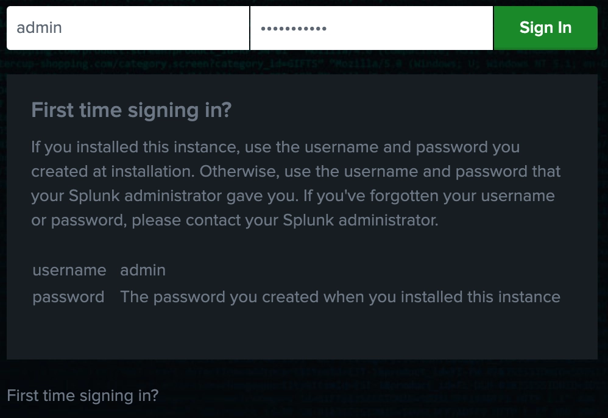

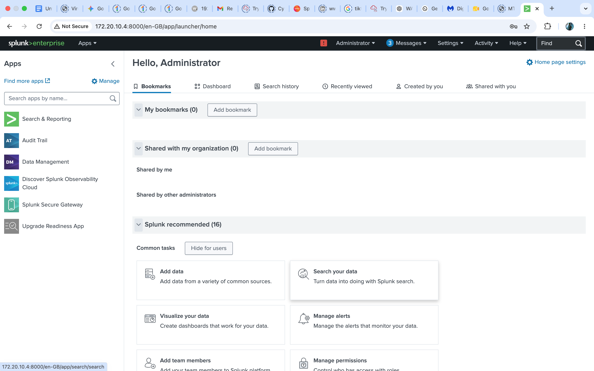

## Local SIEM Deployment & Linux Telemetry Ingestion Pipeline

> *Configured a localized Security Operations Center (SOC) testing environment by deploying Splunk Enterprise on an Ubuntu Server virtual machine. Established a real-time data ingestion pipeline targeting core Linux system authentication logs (`/var/log/auth.log`) to provide complete visibility into system access behavior, user provisioning, and authentication trends.*

**DATE & TIME
MAY 25 | 2:00PM**

#### Infrastructure Specifications

- **Host Machine:** macOS
- **Hypervisor:** Oracle VirtualBox
- **Guest OS:** Ubuntu 22.04 (`UBUNTU-Victim`)
- **SIEM Platform:** Splunk Enterprise (Ingress Port: `8000`)
- **Monitored Telemetry:** `/var/log/auth.log` (Parsed as `linux_secure`)
- **Target Index:** `linux_auth`

#### 1. Securing the Log Ingestion Pipeline (POSIX ACLs)

By default, standard Linux security policies restrict generic application access to `/var/log/auth.log`. To ingest data without introducing a severe privilege escalation risk (such as running Splunk as root):

- Isolated the missing system utilities and deployed standard Access Control List packages: `sudo apt install acl`.
- Implemented strict POSIX Access Control Lists to explicitly provision read permissions exclusively to the isolated daemon user

```
sudo setfacl -m u:splunk:r /var/log/auth.log
```

- Successfully routed the live log stream into a custom-built, dedicated index environment (`linux_auth`) via the Splunk ingestion wizard under the optimized `linux_secure` sourcetype matrix.

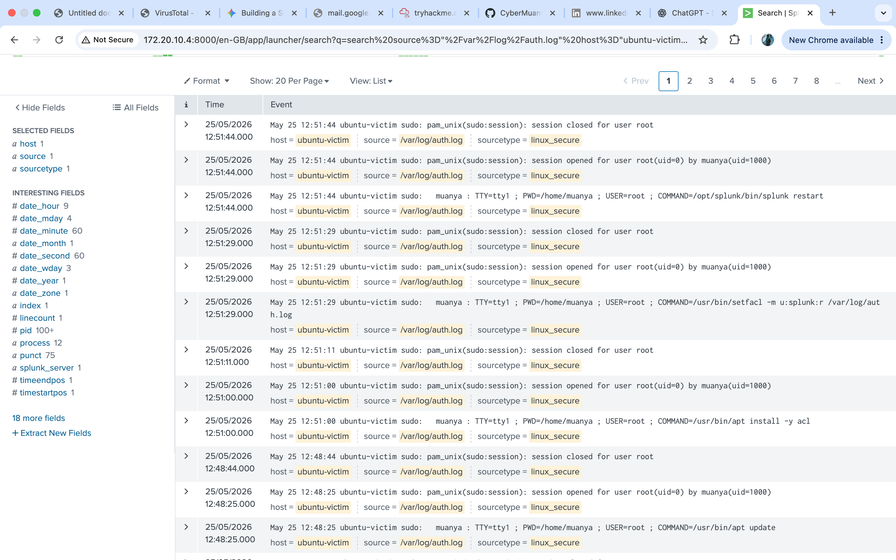

#### 2. Verification

Validated the ingestion pipeline using the **Data Summary** analytics dashboard to verify host status, event counts, and connection health. Executed initial Splunk Processing Language (SPL) validation queries against the raw ingestion data matrix:

Code snippet

```
index="linux_auth"
```

The search successfully returned indexed event rows mapping system orchestration processes, including historical user creation artifacts (`useradd[683]`) and privilege management configurations.

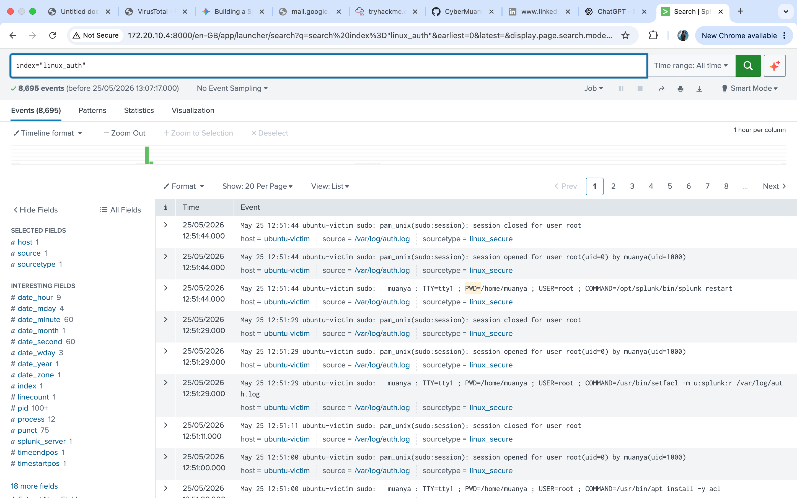


---

**My observation - Splunk, right now, only sees what happens inside `/var/log/auth.log`  which comprise** 

- Successful and failed user logins (`ssh`, `su`, `gdm`)
- The creation, modification, or deletion of system accounts and groups and Whenever a user escalates privileges using `sudo`

**This is because that is the only pipe we have hooked up.** It does *not* automatically ingest everything happening on your Ubuntu machine out of the box.
On an Enterprise scale, there’d be a **Splunk Universal Forwarder (UF)** on every server in the company.

You then configure a central settings file (`inputs.conf`) on that agent to point to a dozen different log locations simultaneously. 

## Active Threat Simulation

> *The core objective of today’s session was to transition our standalone Splunk SIEM deployment from a basic **data ingestion engine** into an **automated detection platform**. By simulating a realistic adversarial attack vector against our infrastructure, we analyzed raw log structures, engineered custom analytical correlation metrics, and deployed a real-time alerting playbook designed to catch brute-force attempts instantly.*

### Step 1: Baseline Infrastructure Verification

Before simulating adversarial activity, the Splunk backend daemon was initialized on the `ubuntu-victim` virtual machine to ensure the forwarding pipeline was listening on port `8000`

```
sudo /opt/splunk/bin/splunk start --run-as-root
```

### Step 2: Adversarial Simulation (Brute-Force Attack)

To generate actionable malicious telemetry, a targeted credential-harvesting/brute-force attack pattern was simulated. By executing rapid, back-to-back switch-user (`su`) commands against the highly privileged `root` account with intentional garbage passwords, we forced the Linux kernel to drop explicit security telemetry into `/var/log/auth.log`

```
su root
# Executed 6 consecutive times to establish an anomaly threshold
```

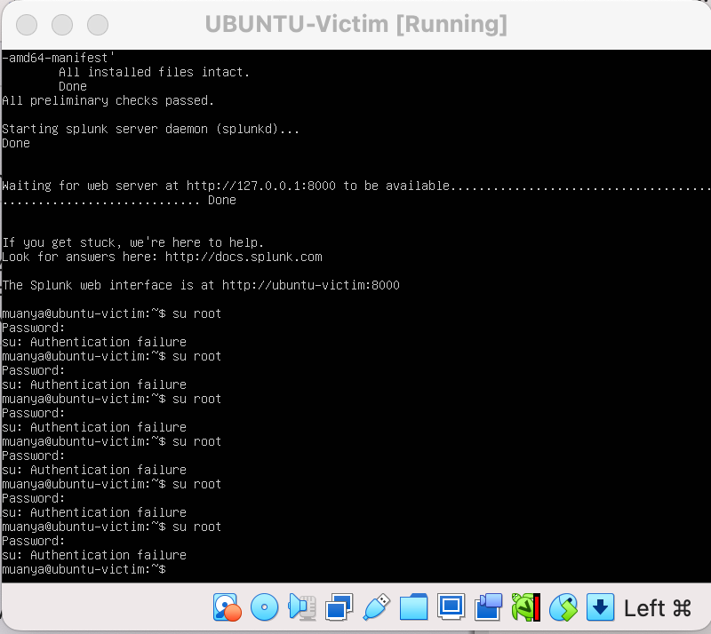

**Telemetric Output Generated:** * `su: Authentication failure` recorded natively on the host endpoint.

- `FAILED SU (to root) muanya on tty1` pushed upstream into Splunk.

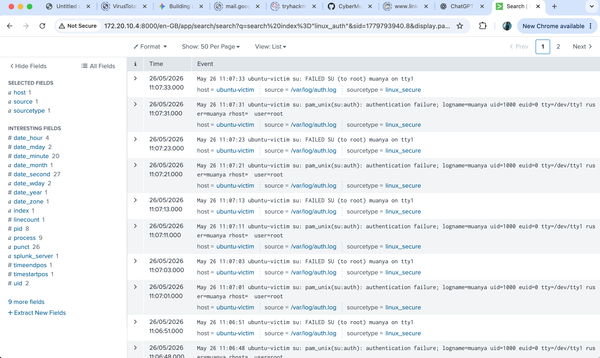

## SIEM Engineering, SPL Analytics, & Real-Time Alert Orchestration.

### The Core Problem: Splunk vs. Wazuh Philosophy

Unlike signature-based intrusion detection tools (like Wazuh) that ship with rigid pre-configured rules, numbers, and severity tags, **Splunk operates as a blank canvas data engine**. It stores the raw text logs perfectly but relies completely on the Security Engineer to define what constitutes a threat.

### The Solution: Statistical Risk Profiling

To parse the raw data streams inside our `linux_auth` index, we authored an advanced **Splunk Processing Language (SPL)** correlation query. This query dynamically evaluates user behavior and appends business-logic threat criteria on the fly:

```
index="linux_auth" "FAILED SU"
| stats count by host, sourcetype
| eval Severity=if(count > 5, "HIGH - Potential Brute Force", "LOW - Standard Typo")
```

### Query Mechanics Breakdown:

1. **`index="linux_auth" "FAILED SU"`**: Filters millions of potential logs down instantly to failed root actions.
2. **`| stats count by host, sourcetype`**: Aggregates raw text occurrences into a single, clean structural data row.
3. **`| eval Severity=...`**: Employs programmatic logic. If an asset registers more than 5 authentication failures inside the monitoring window, Splunk overrides standard reporting to dynamically inject a custom **`HIGH - Potential Brute Force`** severity classification column.

### Automation & Incident Playbook Orchestration

#### Rule Optimization: Scheduled vs. Real-Time

Initially, detection rules are often configured as *Scheduled* cron jobs (e.g., evaluating hourly) to preserve infrastructure resources. However, during an active account-takeover attempt, hourly checks grant attackers a 59-minute blind spot.

To eliminate this gap, the detection engine was pivoted to **Real-time execution**, forcing Splunk to monitor the file stream line-by-line with zero latency.

### Alert Configuration Matrix:

- **Rule Name:** `Linux Brute Force Detected - Excess Failed SU`
- **Trigger Condition Type:** `Custom`
- **Matching Expression:** `search Severity="HIGH*"` *(Instructs the system to bypass standard low-level user typos and only trigger when our threshold conditions are breached).*
- **Incident Response Action:** `Add to Triggered Alerts` mapped with an explicit severity elevation to **High**.

### Defensive Verification & Triage Results

To validate the end-to-end loop, a final wave of authentication attacks was delivered to the server. Because the detection rules were live and evaluating in real-time, the SIEM successfully intercepted the adversarial behavioral pattern.

Navigating to **Activity > Triggered Alerts** confirmed a hardened defensive pipeline:

- **The Result:** Five distinct security incident entries instantly populated the master SOC triage dashboard.

**Portfolio Visual Evidence**

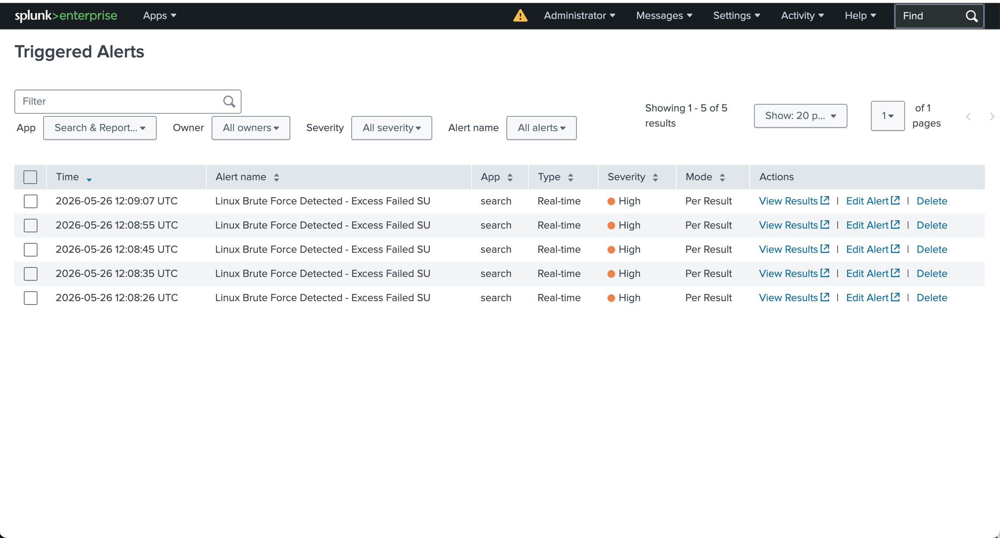

## Custom SIEM Security Operations Dashboard

**Focus: The "Total Failed Logins" Single-Value Indicator**

> *We want a giant, bold number at the top of the dashboard that immediately alerts a security analyst to the total scale of an attack over the last 24 hours.*

### Component Engineering & Analytics

#### Panel 1: Key Performance Indicator (KPI) Single-Value Counter

- **Objective:** Provide instant visibility into total authentication compromise pressure on the environment.
- **Visualization Type:** Single Value Tile
- **Analytical Search Syntax (SPL):** `index="linux_auth" "FAILED SU" | stats count`
- **Mechanics:** Performs a high-speed calculation collapsing unstructured textual log indices down to a rolling historical integer, immediately flashing the scale of malicious attempts to the triage team.

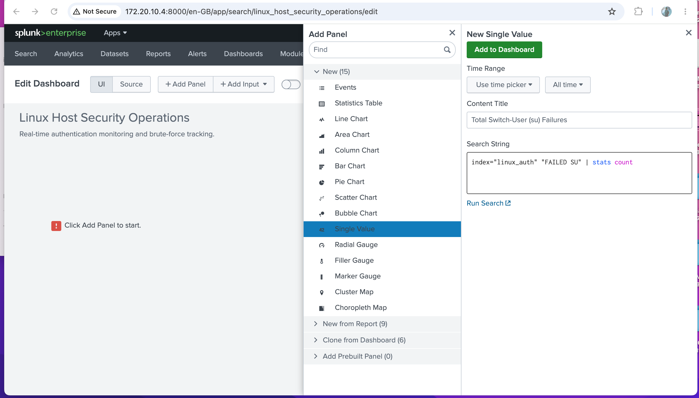

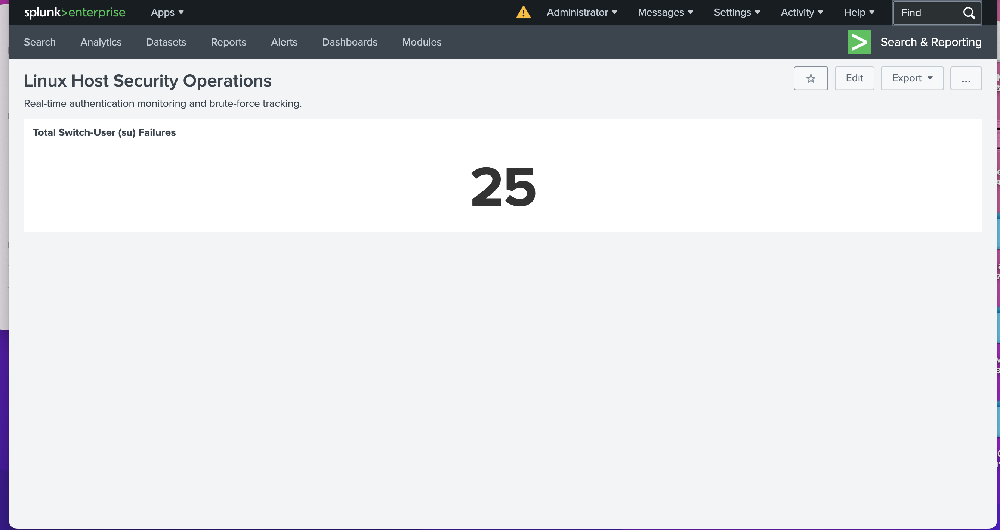

#### Panel 2: Time-Series Threat Velocity Chart

- **Objective:** Track adversarial behaviors chronologically to identify attack orchestration windows, script iterations, and brute-force patterns.
- **Visualization Type:** Line Chart
- **Analytical Search Syntax (SPL):** `index="linux_auth" "FAILED SU" | timechart count by host`
- **Mechanics:** Utilizes the advanced `timechart` parsing command to segment raw telemetry timestamps into automated visual graph buckets categorized distinctly by individual system host fields.

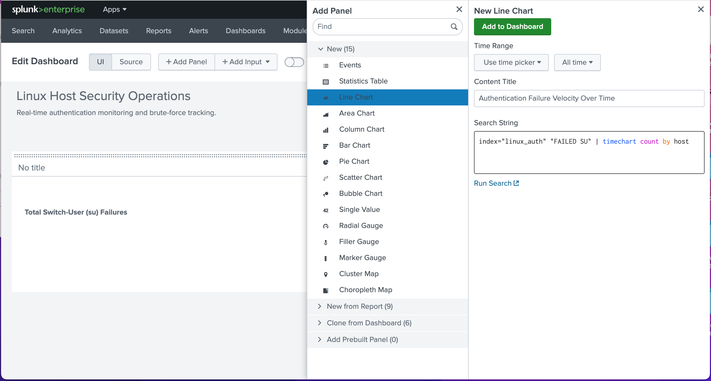

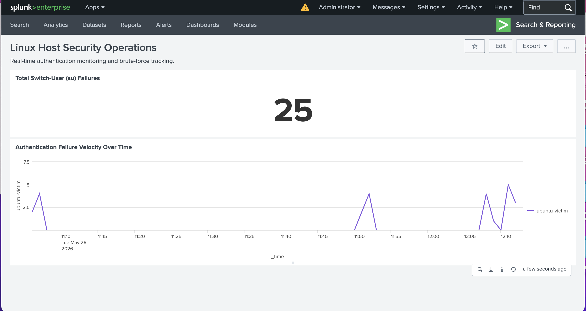

---

**Upon completing custom UI layouts, the workspace was published to production mode. The interface actively processed background data to yield automated visualizations mapping a persistent brute-force attack run against our targeted internal vector.**

## Kali Hydra Attack & Splunk Detection Lab

> *The goal of this lab was to simulate a remote network attack using Kali Linux, analyze how the target operating system logs the activity, and update our Splunk SIEM dashboard to automatically detect the attack signature.*

### Phase 1: Attack Execution via Hydra

Using **Hydra** on Kali Linux, an automated password-spraying attack was launched against the target server's SSH service (Port 22). The attack targeted the `root` user account using the standard `rockyou.txt` wordlist. 

`hydra -l root -P /usr/share/wordlists/rockyou.txt 172.20.10.4 ssh -t 4 -V`

#### Attack Parameters:

- **Target IP:** `172.20.10.4` (Ubuntu Victim)
- **Wordlist Used:** `/usr/share/wordlists/rockyou.txt`
- **Verbose Mode (`V`):** Allowed us to see every password attempt live in the Kali terminal as it was being tried.

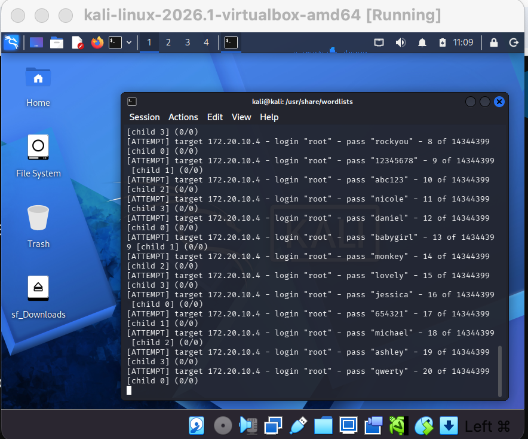

#### Phase 2: Log Analysis in Splunk

While manual, local login failures generate a `"FAILED SU"` log entry, the network-based Hydra attack generated **`sshd`** process logs containing the string **`"Failed password"`**.

- **Raw Log Example:** `May 27 15:11:11 ubuntu-victim sshd[8642]: Failed password for root from 172.20.10.2 port 53432 ssh2`
- **Key Discovery:** The logs explicitly captured the attacker's source IP address (`172.20.10.2`), mapping the footprint back to our Kali machine.

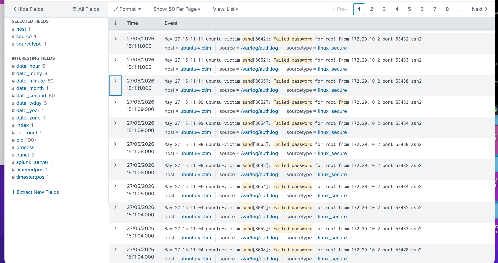

#### Phase 3: Dashboard Optimization

To ensure the dashboard displays both local and network-level threats, the Splunk Search Processing Language (SPL) queries were updated using an `OR` statement to capture both attack types simultaneously.

**Updated Counter Query & Updated Time Chart Query**

```
index="linux_auth" ("FAILED SU" OR "Failed password") | stats count
```

- **Result:** The total failure count automatically updated from 25 baseline events to **4,781 total authentication failures**, reflecting the massive scale of the Hydra attack.

```
index="linux_auth" ("FAILED SU" OR "Failed password") | timechart count by host
```

- **Result:** Created a massive visual spike on the graph, pinpointing the exact minute the automated Hydra script flooded the system with traffic.

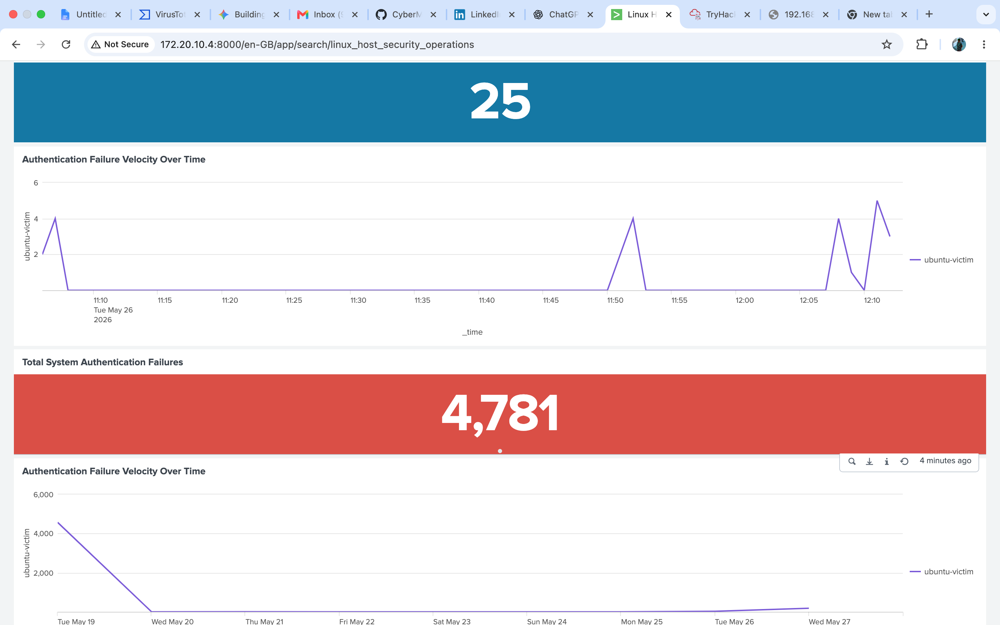

#### Final Layout Deployment

The dashboard panels were customized into a sleek, side-by-side layout in dark mode. This layout provides a real-time overview of total authentication failures right next to the timeline velocity graph, allowing security analysts to immediately spot automated brute-force behavior.

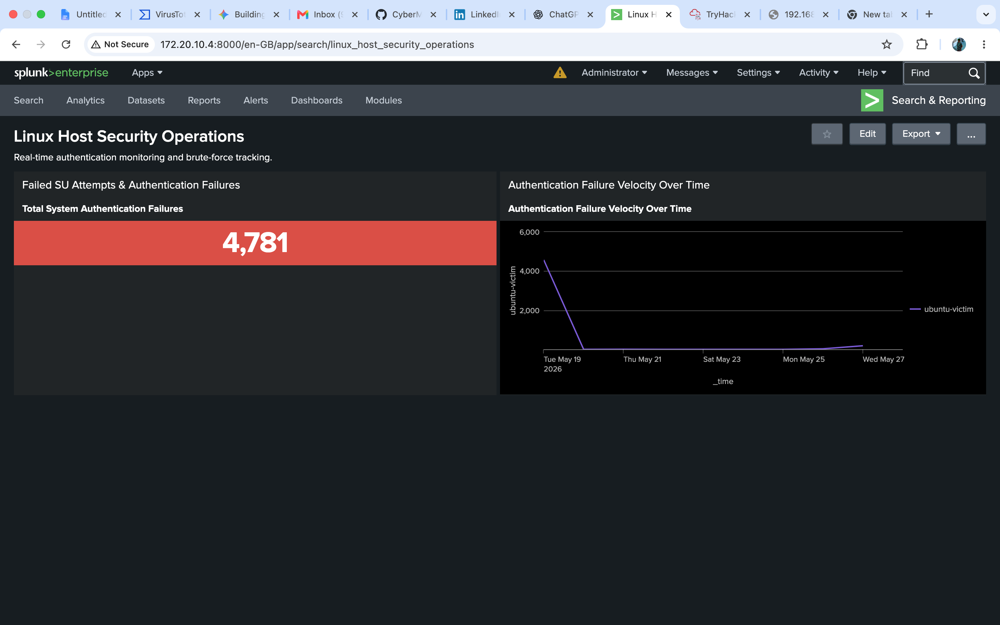

## Automated Detection of Brute-Force Attacks using Splunk

> *I developed a production-grade detection rule to identify unauthorized access attempts by leveraging **Kali Linux** for offensive simulation and **Splunk Enterprise** for log ingestion and real-time analysis. 
>     This project involved establishing a security lab to simulate and detect high-velocity SSH brute-force attacks.*

#### Adversarial Simulation (Offensive Phase)

I utilized **Hydra** on a Kali Linux instance to conduct a brute-force attack against an Ubuntu target host.

- **Methodology:** Targeted the `root` account over SSH to trigger rapid-fire authentication failure logs.
- **Result:** Generated a high volume of `Failed password` logs in the target host's `/var/log/auth.log`
- code snippet: `hydra -l root -P /usr/share/wordlists/rockyou.txt 172.20.10.4 ssh -t 4 -V`

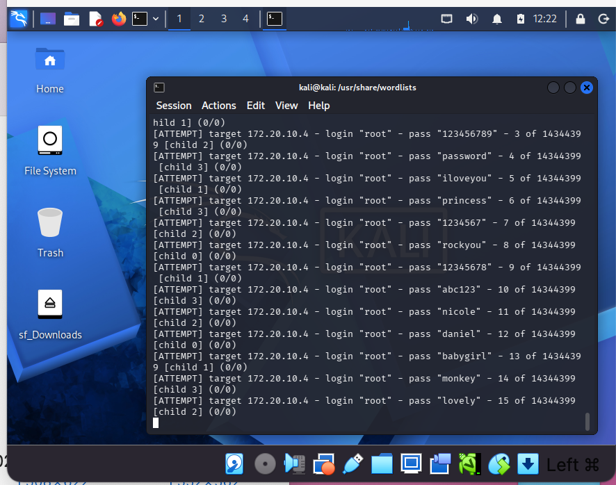

#### Alert Engineering (Detection Phase)

To minimize manual monitoring, I configured a **Real-time Alert** in Splunk. I defined a threshold to trigger only when anomalous behavior is detected, effectively filtering out single-user typos while catching automated attacks.

## Trigger Logic:
- **Search:** `index="linux_auth" "Failed password" | stats count by src_ip | where count > 15`
- **Condition:** Number of results > 15 within a 1-minute window.
- **Suppression:** Enabled a 5-minute throttle to prevent alert fatigue (duplicate alerts for the same source).

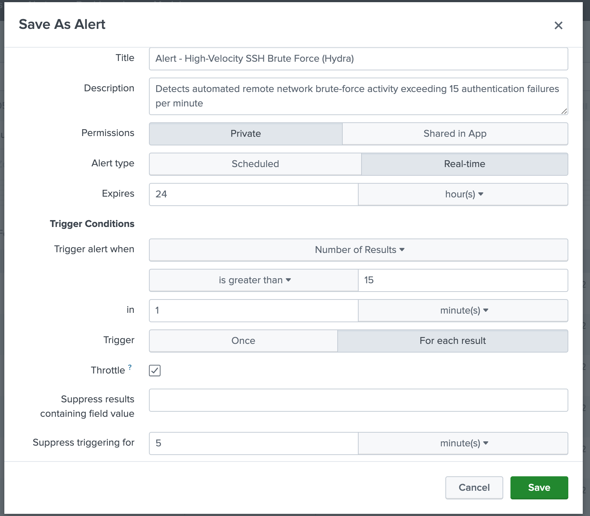

#### Incident Verification (Triage Phase)

Finally, I validated that the alert correctly transitioned from a passive search to a triggered incident, confirming the logic was production-ready.

- **Observation:** The "Triggered Alerts" dashboard successfully recorded the "High-Velocity SSH Brute Force (Hydra)" event with "Critical" severity.

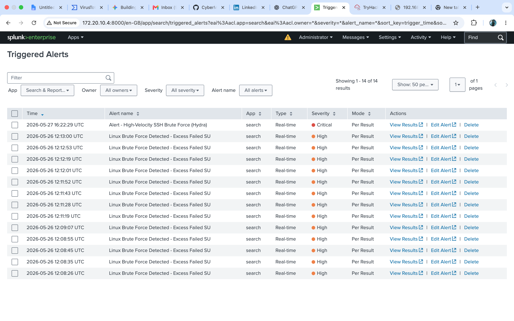

#### Log Ingestion & Investigation (Analysis Phase)

After ingestion into Splunk, I used Search Processing Language (SPL) to verify the data was being parsed correctly and was searchable within the designated index.

- **Search Query:** `index="linux_auth" "Failed password"`
- **Outcome:** Successfully isolated the malicious login attempts, confirming that Splunk was capturing the `src_ip` and timestamp metadata required for correlation.

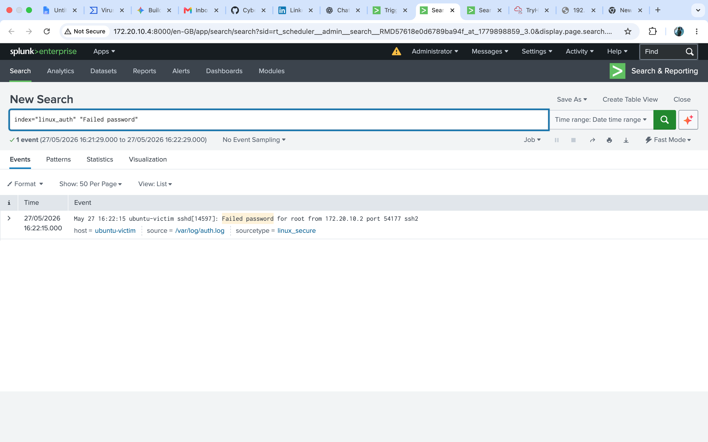
