# P6: Vulnerability Assessment and Security Validation Using Nmap, OpenVAS, and Splunk. | JUNE 4

> *This project is meant to establish a standardized pipeline for identifying and  assessing and security vulnerabilities using an integrated toolset (Nmap, OpenVAS, Splunk).*

#### **Phase 1: Comparative Network Vulnerability Scan of Ubuntu Server and Metasploitable2** using Nmap.

> *The goal of this lab is to perform vulnerability scanning in a controlled VirtualBox environment using Nmap. The project compares a realistic Ubuntu server with a deliberately vulnerable Metasploitable2 machine to show how service exposure, outdated software, and insecure configurations affect vulnerability findings.*

**DATE & TIME:
JUNE 4 | 10:00AM**

```markdown
**PROJECT LAB**

-	Scanner machine: Kali Linux
- Realistic target: Ubuntu-Victim
- Vulnerable target: Metasploitable2
- logging/SIEM: Splunk-Server
- Tools: Nmap, OpenVAS/Greenbone, Splunk
- Lab network: `192.168.56.0/24`

## Identified Lab IP Addresses

- Kali Linux: `192.168.56.4`
- Ubuntu-Victim: `192.168.56.6`
- Metasploitable2: `192.168.56.5`
- Splunk-Server: `192.168.56.10`
```

#### **UBUNTU-VICTIM (MORE REALISTIC SERVER)**

**U1 :Ubuntu-Victim Baseline Nmap Scan**

The baseline Nmap scan was run from Kali:
`sudo nmap -sV -sC -O -oA ubuntu_victim_baseline 192.168.56.6`

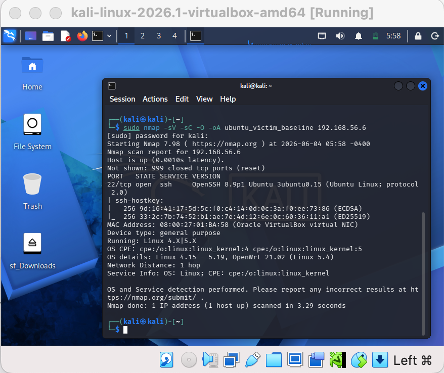

```markdown
Result summary:

- Target: `192.168.56.6`
- Host status: Up
- Open port: `22/tcp`
- Service: SSH
- Closed TCP ports shown: 999
```

**Interpretation:**
Ubuntu-Victim had a very small attack surface. Only SSH was exposed, which is normal for a minimal Ubuntu Server installation. This provides a realistic baseline target where vulnerability exposure is limited because few network services are reachable.

**U2: Ubuntu-Victim SSH Vulnerability Script Scan**

Because SSH was the only exposed service, a targeted Nmap vulnerability script scan was run against port 22

`sudo nmap --script vuln -p 22 -oA ubuntu_victim_vuln 192.168.56.6`

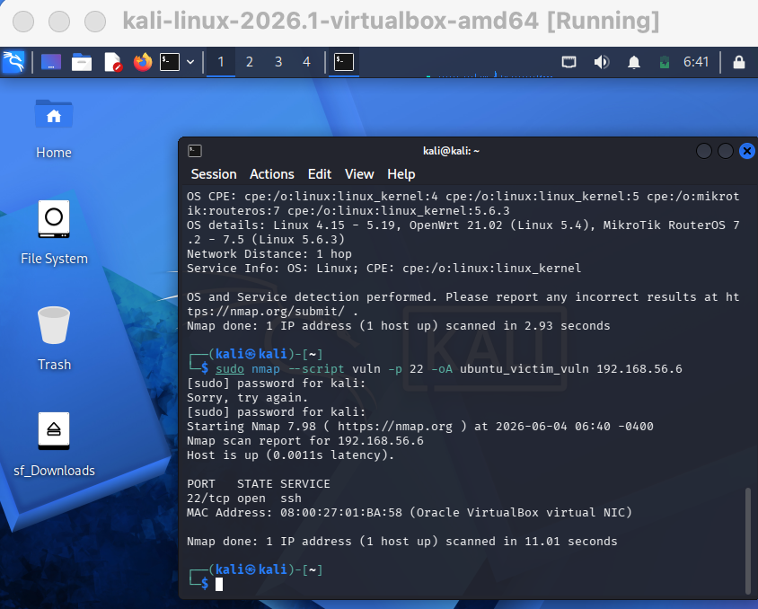

**Result summary:**

- The scan focused only on SSH.
- No major vulnerability findings were shown by Nmap NSE scripts.
- This supports the conclusion that Ubuntu-Victim has a limited exposed attack surface.

**U3: Ubuntu-Victim Full TCP Port Scan**

This full TCP scan is used to confirm there are no hidden services on high ports:

`sudo nmap -p- --min-rate 1000 -oA ubuntu_victim_full_tcp 192.168.56.6`

**Purpose:**
- Scan all TCP ports from 1 to 65535.
- Confirm whether Ubuntu-Victim has any services running outside the default top 1000 ports.
- Strengthen the conclusion that the target has a small attack surface.

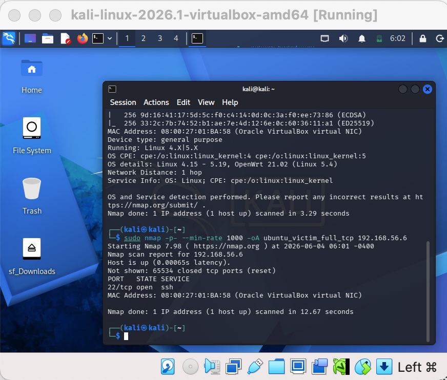

**Ubuntu-Victim Nmap conclusion:**
Ubuntu-Victim exposed only SSH on port `22/tcp`. The detected SSH version was OpenSSH 8.9p1 Ubuntu 3ubuntu0.15. No major vulnerability findings were shown by the Nmap vulnerability script scan. Based on the Nmap results, Ubuntu-Victim represents a realistic low-exposure Linux server with a limited attack surface.

#### METASPLOITABLE2 (DELIBERATELY VULNERABLE MACHINE)

**M1: Metasploitable2 Baseline Nmap Scan**

Command used:

`sudo nmap -sV -sC -O -oA metasploitable2_baseline 192.168.56.5`

**Purpose**

This scan identified open ports, service versions, default script findings, and operating system information for the Metasploitable2 target.

**Key Results**

Target: 192.168.56.5
Host status: Up
Closed TCP ports: 977
Open TCP ports found: 23

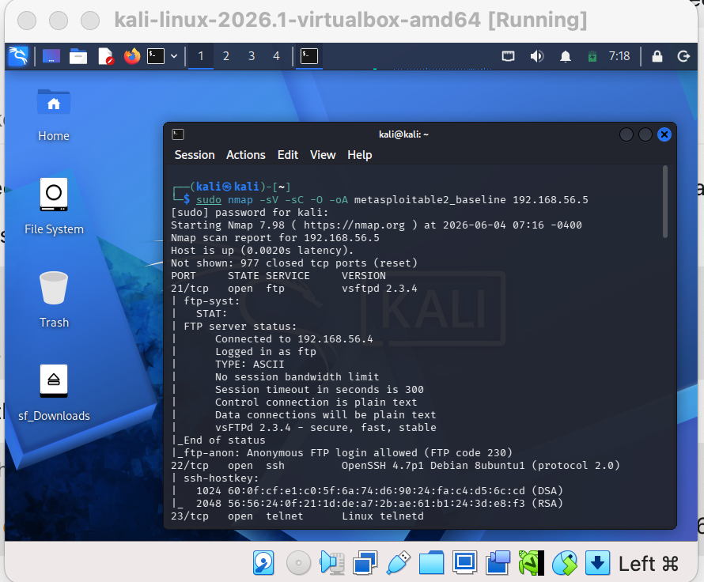

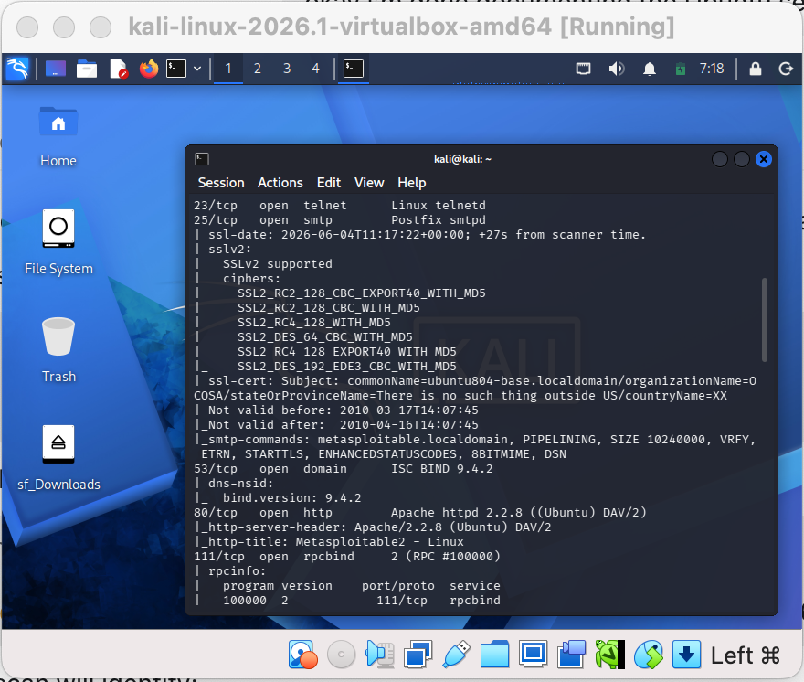

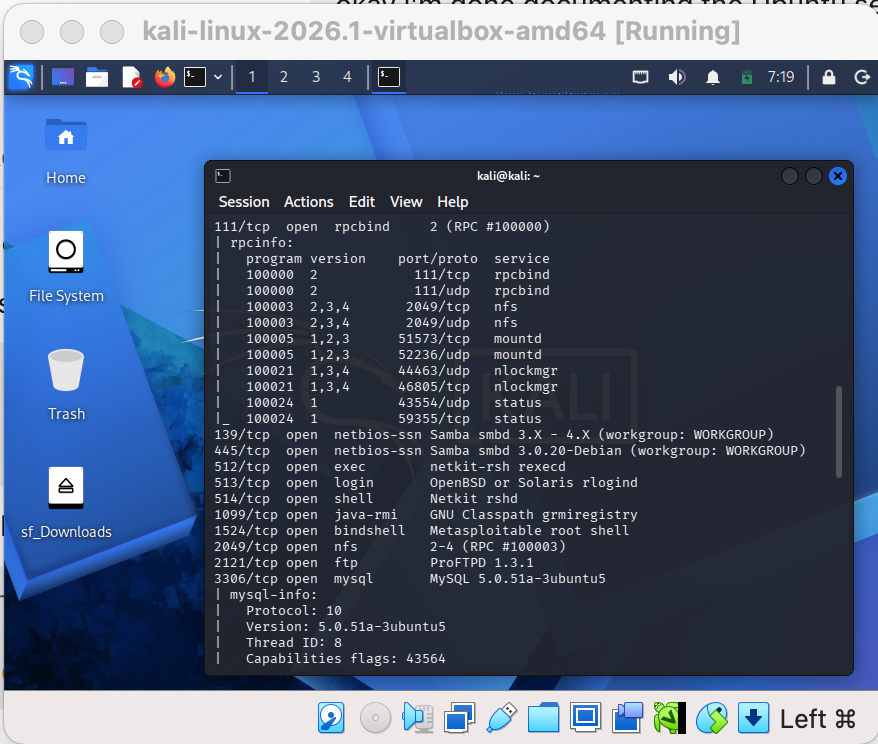

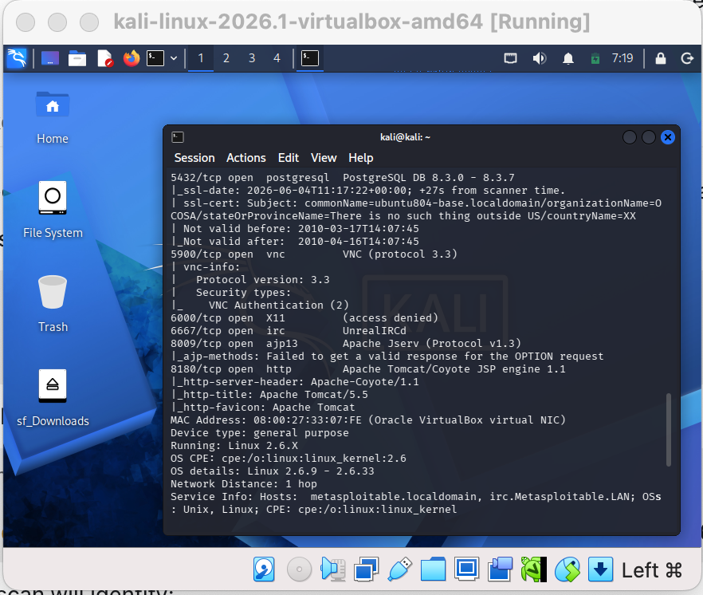

| **Port** | **Service** |
| --- | --- |
| 21 | FTP |
| 22 | SSH |
| 23 | Telnet |
| 25 | SMTP |
| 53 | DNS |
| 80 | HTTP |
| 111 | RPC |
| 139 | NetBIOS |
| 445 | SMB |
| 512 | rexec |
| 513 | rlogin |
| 514 | shell |
| 1099 | Java RMI |
| 1524 | bind shell |
| 2049 | NFS |
| 2121 | FTP |
| 3306 | MySQL |
| 5432 | PostgreSQL |
| 5900 | VNC |
| 6000 | X11 |
| 6667 | IRC |
| 8009 | AJP13 |
| 8180 | HTTP |

**Interpretation**

**Metasploitable2** has a much larger attack surface than **Ubuntu-Victim**. Ubuntu-Victim exposed only SSH, while **Metasploitable2** exposed many services across remote login, file sharing, databases, web servers, and administrative protocols. This explains why Metasploitable2 is expected to produce more vulnerability findings: it runs outdated services and intentionally insecure configurations for training purposes.

**M2: Full TCP Scan Result**

Command used:

`sudo nmap -p- --min-rate 1000 -oA metasploitable2_full_tcp 192.168.56.5`

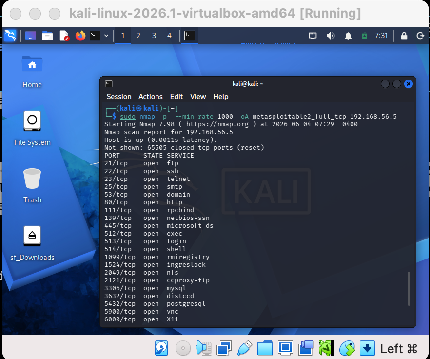

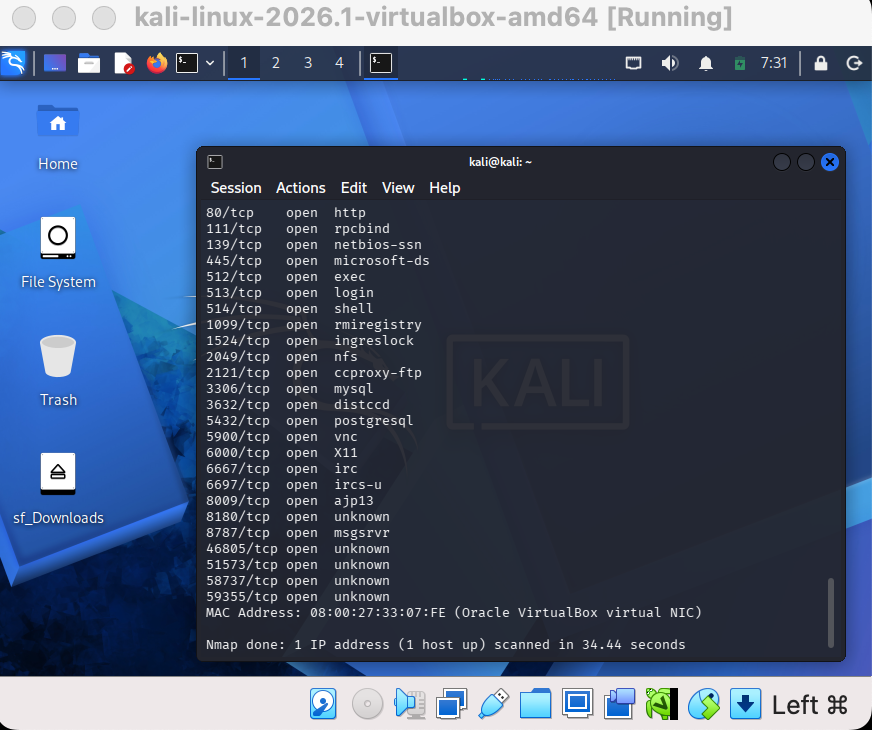

The baseline scan showed 23 open ports. The full TCP scan found **28 open TCP ports**, so it discovered **5 additional high ports**.

Additional ports found

| **Port** | **Service** |
| --- | --- |
| 6697 | ircs-u |
| 8787 | msgsrvr |
| 46805 | unknown |
| 58737 | unknown |
| 59355 | unknown |

**Implication**

A full TCP port scan was performed against Metasploitable2 to check all 65,535 TCP ports. Unlike the Ubuntu-Victim target, which exposed only SSH, Metasploitable2 exposed numerous services across standard and high-numbered ports. The **full scan** confirmed a significantly larger attack surface and identified additional open ports such as 6697, 8787, 46805, 58737, and 59355. This shows why full-port scanning is useful: default scans may miss services running outside the most common ports

**M3: Vulnerability script scan**

Command used
`sudo nmap --script vuln -oA metasploitable2_vuln 192.168.56.5`

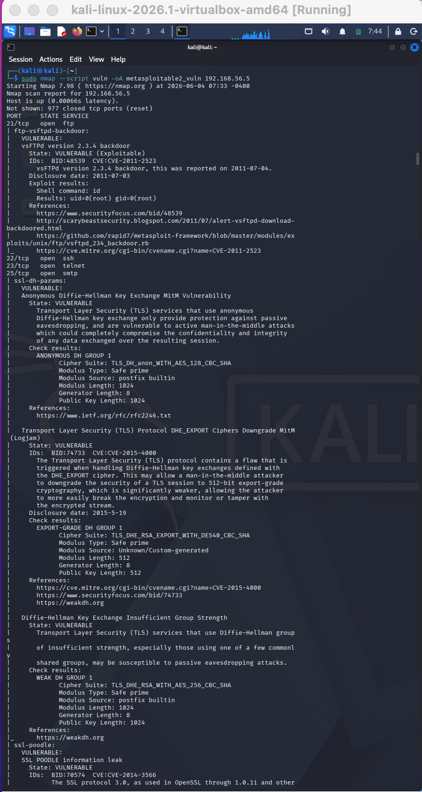

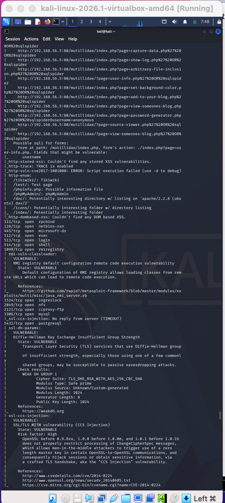

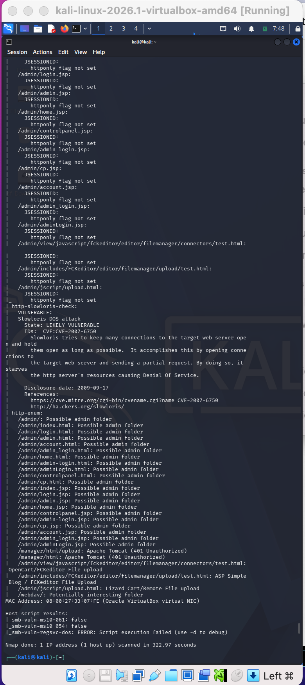

**Important points**

The scan found multiple vulnerability categories:

- Backdoored service: vsftpd 2.3.4
- Weak encryption/TLS issues
- Exposed web applications
- Possible SQL injection
- Remote code execution risk
- Insecure admin paths
- Denial-of-service weakness
- Missing cookie security flags

**Summary**

The Nmap vulnerability script scan against Metasploitable2 identified multiple high-risk findings across FTP, SMTP, HTTP, Java RMI and Apache. The most critical finding was the vsftpd 2.3.4 backdoor on port 21, which Nmap marked as exploitable and associated with CVE-2011-2523. 

Additional findings included weak TLS configurations, possible SQL injection in some web applications, Java RMI remote code execution risk, SSL/TLS vulnerabilities, Slowloris denial-of-service exposure, and insecure web/admin paths. 

These results demonstrate that Metasploitable2 has a much larger and more dangerous attack surface than Ubuntu-Victim.

> **Nmap Phase Conclusion**
>
> The Nmap phase showed a clear difference between a realistic server and an intentionally vulnerable host. Ubuntu-Victim exposed only SSH on port 22, resulting in a small attack surface and no major vulnerability findings from Nmap scripts. In contrast, Metasploitable2 exposed numerous services, including FTP, Telnet, SMB, databases, web applications, and remote access services. The Nmap vulnerability scan identified several high-risk issues on Metasploitable2, including a vsftpd backdoor, weak SSL/TLS configurations, possible SQL injection, Java RMI remote code execution risk, and insecure web/admin paths. This comparison demonstrates how exposed services, outdated software, and insecure configurations significantly increase security risk.

#### Phase 2: Comparative Vulnerability Assessment of Ubuntu Server and Metasploitable2 Using OpenVAS

### DATE & TIME
JUNE 22 | 6:00PM

> *The goal of this phase is to use OpenVAS/Greenbone to perform a deeper vulnerability assessment of the same two lab targets scanned with Nmap.*
>
>  *While Nmap was used to identify exposed services and script-based findings, OpenVAS will provide a more formal vulnerability assessment with severity ratings, CVEs, risk scores, and remediation recommendations.*

#### UBUNTU-VICTIM

## Assessment Environment

| Component | Description |
| --- | --- |
| Assessment Platform | Kali Linux |
| Vulnerability Scanner | OpenVAS / Greenbone Security Assistant |
| Scan Configuration | Full and Fast |
| Target 1 | Ubuntu Server |
| Target 2 | Metasploitable2 |
| Network Type | Host-Only Virtual Network |

### Ubuntu Server Assessment

#### Target Information

| Parameter | Value |
| --- | --- |
| Hostname | Ubuntu Server |
| IP Address | 192.168.56.6 |
| Scan Profile | Full and Fast |

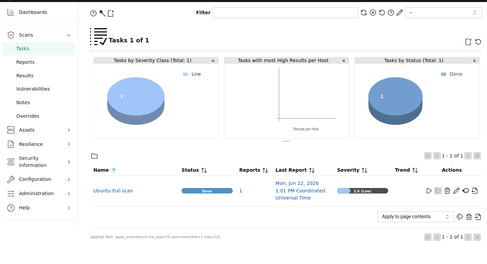

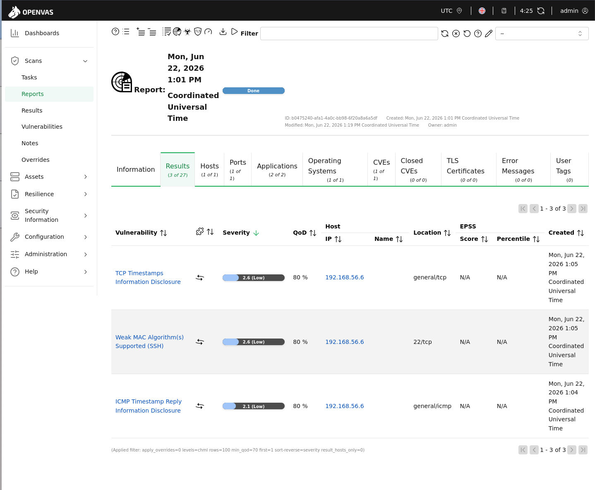

#### METASPLOITABLE

### Metasploitable2 Assessment

#### Target Information

| Parameter | Value |
| --- | --- |
| Hostname | Metasploitable2 |
| IP Address | 192.168.56.8 |
| Scan Profile | Full and Fast |

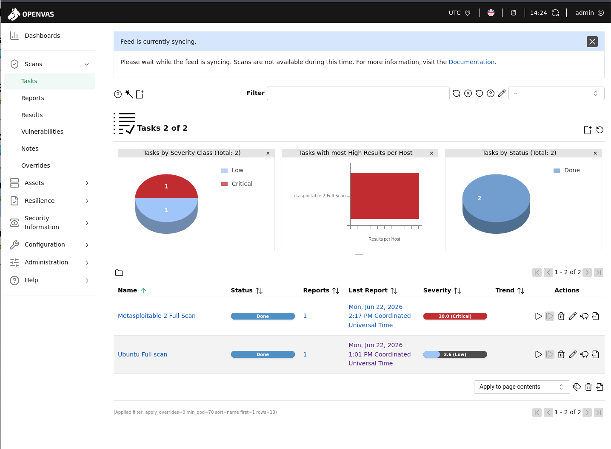

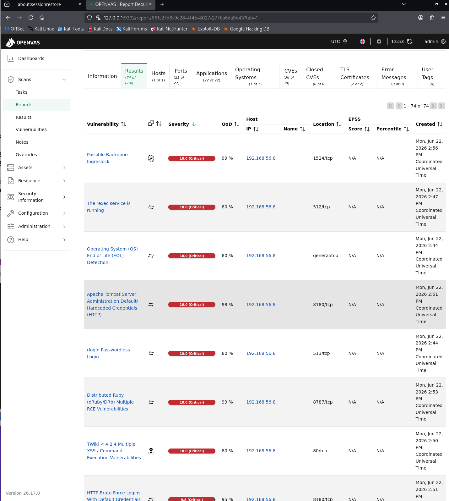

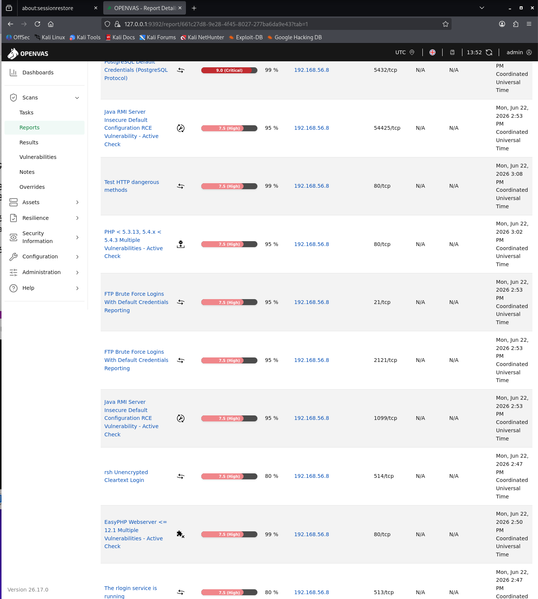

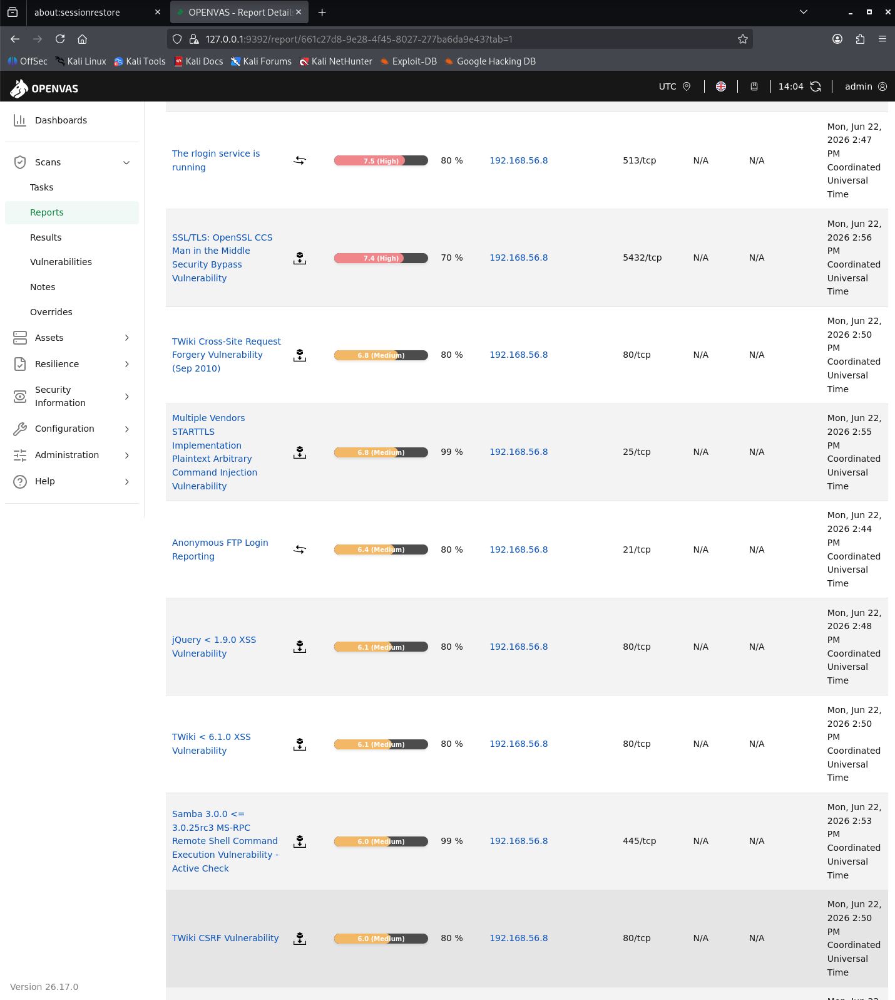

## Scan Results Summary

| Metric | Result |
| --- | --- |
| Overall Severity | 10.0 (Critical) |
| Vulnerabilities Identified | 74 |
| CVEs Detected | 38 |
| Open Ports | 21 |
| Applications Detected | 22 |
| Risk Level | Critical |

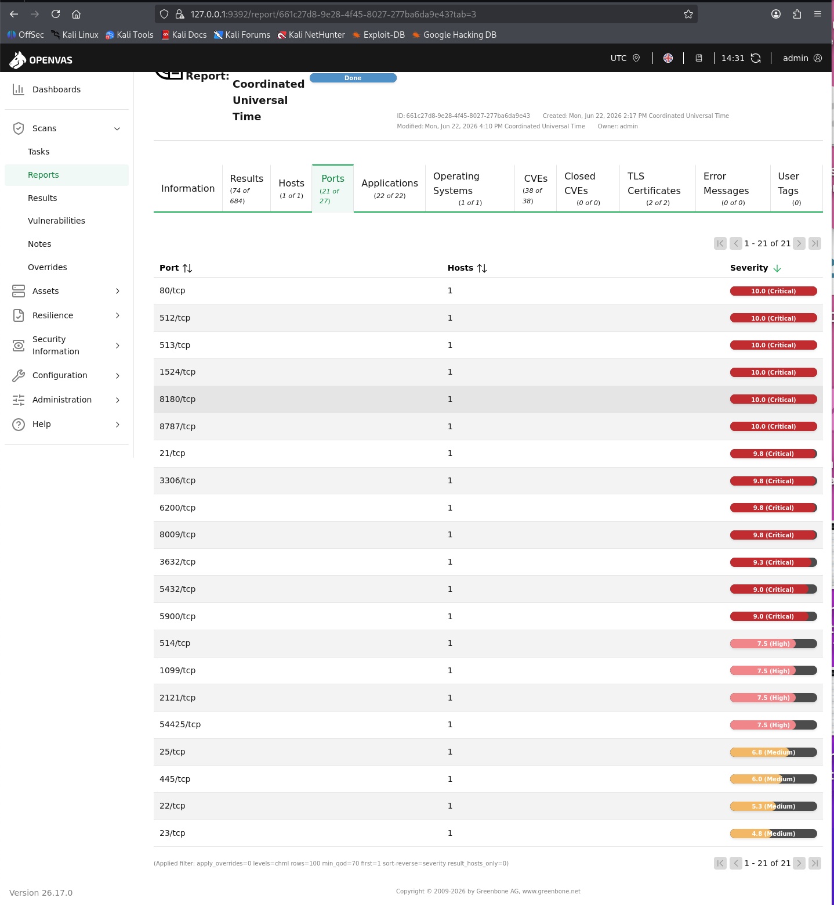

## Critical Vulnerabilities Identified

### Possible Backdoor: Ingreslock

Port: 1524/tcp

Severity: 10.0 (Critical)

Description:

OpenVAS identified the Ingreslock service, commonly associated with unauthorized shell access and backdoor functionality.

Impact:

Potential full system compromise.

---

### Rexec Service Running

Port: 512/tcp

Severity: 10.0 (Critical)

Description:

The rexec service permits remote command execution using insecure authentication mechanisms.

Impact:

Remote attackers may execute commands on the target host.

---

### Rlogin Passwordless Login

Port: 513/tcp

Severity: 10.0 (Critical)

Description:

The rlogin service was detected and may permit insecure remote authentication.

Impact:

Unauthorized remote access.

---

### Apache Tomcat Default Credentials

Port: 8180/tcp

Severity: 10.0 (Critical)

Description:

Apache Tomcat administrative services were found using default or hardcoded credentials.

Impact:

Administrative compromise and potential remote code execution.

---

### Distributed Ruby (DRb) Multiple Remote Code Execution Vulnerabilities

Port: 8787/tcp

Severity: 10.0 (Critical)

Impact:

Remote attackers may execute arbitrary code and obtain system access.

---

### TWiki Multiple Command Execution Vulnerabilities

Port: 80/tcp

Severity: 10.0 (Critical)

Impact:

Attackers may execute arbitrary commands through vulnerable web application components.

---

## Significant CVEs Detected

| CVE | Description | Severity |
| --- | --- | --- |
| CVE-2020-1938 | Apache Tomcat Ghostcat | 9.8 Critical |
| CVE-2011-2523 | vsFTPd Backdoor Vulnerability | 9.8 Critical |
| CVE-2004-2687 | DistCC Remote Command Execution | 9.3 Critical |
| CVE-2011-3556 | Java RMI Insecure Configuration | 7.5 High |

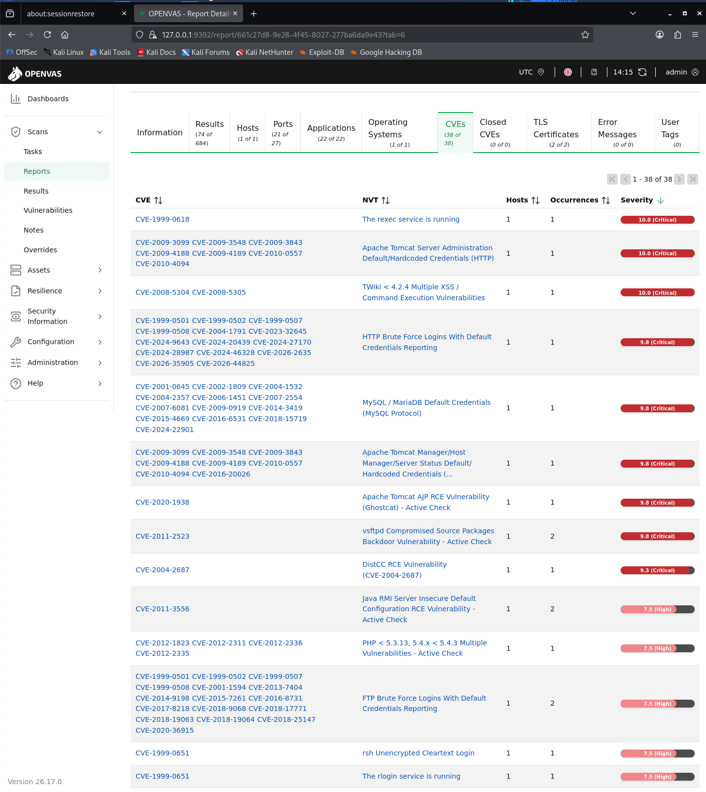

## Metasploitable2 Analysis

OpenVAS identified numerous critical vulnerabilities across multiple services. Several findings involved default credentials, insecure remote access protocols, remote code execution vulnerabilities, and vulnerable web applications.

The system exposed twenty-one open ports and twenty-two applications, substantially increasing its attack surface compared to the Ubuntu Server.

The presence of thirty-eight CVEs and multiple critical vulnerabilities demonstrates that Metasploitable2 is highly susceptible to compromise and serves as an effective platform for vulnerability assessment and penetration testing exercises.

### **Comparative Analysis**

| Metric | Ubuntu Server | Metasploitable2 |
| --- | --- | --- |
| Findings | 3 | 74 |
| CVEs | 1 | 38 |
| Open Ports | 1 | 21 |
| Applications Detected | 2 | 22 |
| Severity Score | 2.6 (Low) | 10.0 (Critical) |
| Risk Level | Low | Critical |

---

#### Remediation Recommendations

#### Ubuntu Server

1. Disable ICMP timestamp responses.
2. Disable TCP timestamp responses where operationally feasible.
3. Remove weak SSH MAC algorithms.
4. Maintain routine operating system patching and updates.

#### Metasploitable2

1. Remove all default credentials.
2. Disable insecure services including rlogin, rexec, and rsh.
3. Upgrade vulnerable applications and services.
4. Apply security patches associated with identified CVEs.
5. Close unnecessary network ports.
6. Implement network segmentation and access controls.
7. Replace unsupported or end-of-life software components.

---

#### Conclusion

The OpenVAS vulnerability assessment confirmed the findings obtained during the Nmap reconnaissance phase. Ubuntu Server demonstrated a relatively secure configuration with only low-severity findings and a limited attack surface. In contrast, Metasploitable2 exhibited numerous critical vulnerabilities, default credentials, insecure services, and multiple remote code execution weaknesses.

The assessment highlights the importance of secure system configuration, vulnerability management, and timely patching in reducing organizational risk. The significant disparity between the two systems demonstrates how attack surface reduction and security hardening directly impact an organization's overall security posture.
