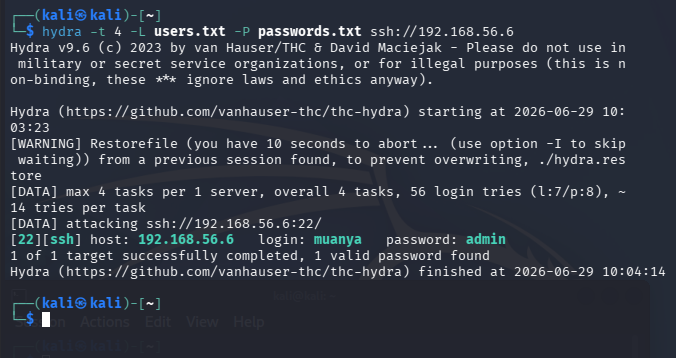
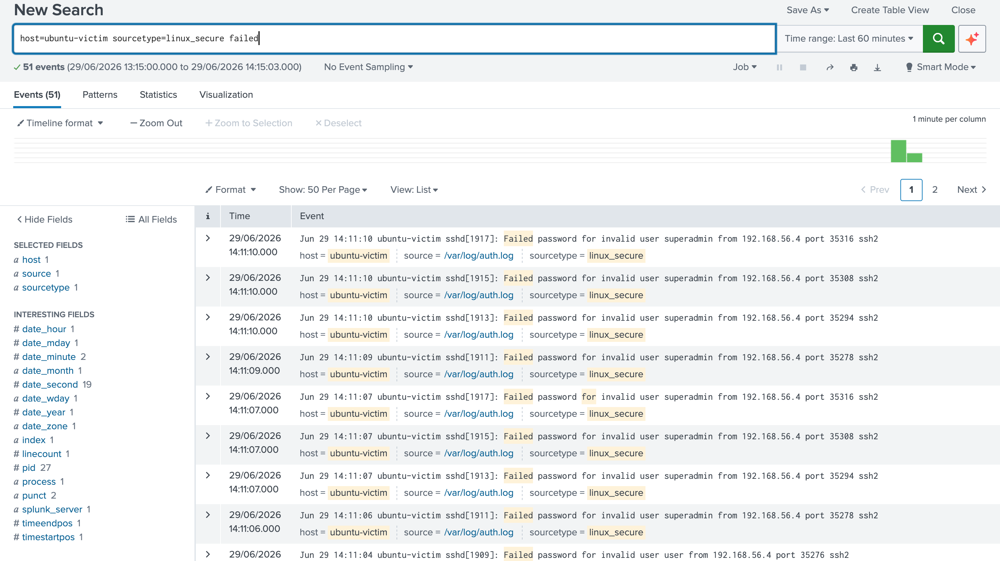
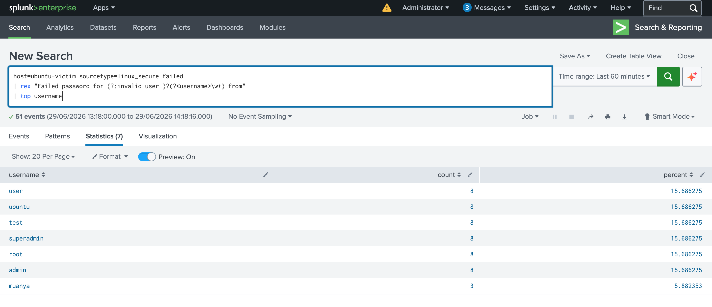
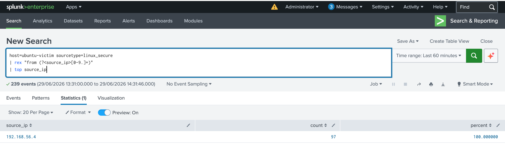
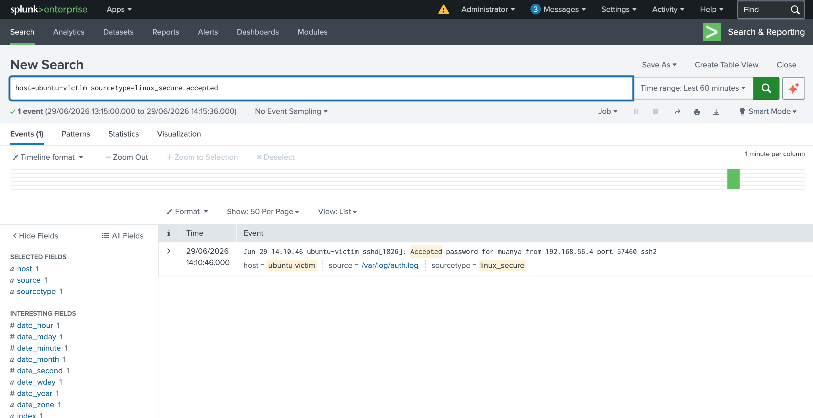
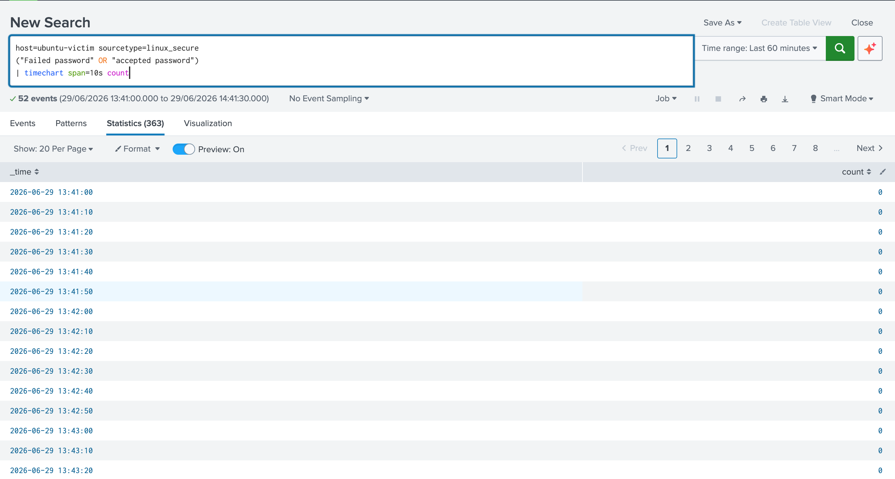

# P7: Threat Hunting Using Splunk Enterprise: Detecting SSH Brute-Force Attacks on Ubuntu Linux

> ## Project Objective
>
> *This project extends the vulnerability assessment conducted in **P6** by investigating whether identified vulnerabilities exhibit evidence of exploitation, suspicious activity, or attacker behavior within the monitored environment.*
>
> *Using Splunk as the central analysis platform, threat hunting activities was conducted  on Ubuntu Server (hardened target)*

---

# Lab Environment

| Component | IP Address | Purpose |
| --- | --- | --- |
| Splunk Enterprise | 192.168.56.10 | SIEM |
| Ubuntu Victim | 192.168.56.6 | Target Server |
| Kali Linux | 192.168.56.4 | Attacker |

#### UBUNTU

# Attack Scenario

The attacker (Kali Linux) launched an SSH password brute-force attack against the Ubuntu victim using Hydra.

Command used:

```
hydra-t4-L users.txt-P passwords.txt ssh://192.168.56.6
```

Hydra attempted multiple username/password combinations until valid credentials were discovered.

Successful credentials:

```
Username: muanya
Password: admin
```

---



# Evidence Collected

## Failed Authentication Events

Search:

```
host=ubuntu-victim sourcetype=linux_secure failed
```

Findings:

- Numerous failed SSH authentication attempts.
- Multiple usernames were targeted.
- Events originated from a single attacking host.



## Successful Authentication

Search:

```
host=ubuntu-victim sourcetype=linux_secure accepted
```

Evidence:

```
Accepted password for muanya from 192.168.56.4
```

Conclusion:

The attacker successfully authenticated after multiple failed attempts.


# Investigation 1 — Most Targeted Usernames

SPL

```
host=ubuntu-victim sourcetype=linux_secure failed
| rex "Failed password for (?:invalid user )?(?<username>\w+) from"
| top username
```

Purpose

Extract the username from each failed authentication event and identify the accounts most frequently targeted.



Analysis

Hydra cycled through the supplied username list.

The account **muanya** received fewer failed attempts because Hydra terminated once it discovered the correct password.

# Investigation 2 — Attacking Source IP

SPL

```
host=ubuntu-victim sourcetype=linux_secure failed
| rex "from (?<source_ip>[0-9.]+)"
| top source_ip
```

Purpose

Identify the IP address responsible for the failed authentication attempts.



Analysis

Every failed authentication originated from the Kali attacker.

This immediately identifies the attacker's source host.

# Investigation 3 — Successful Login

SPL

```
host=ubuntu-victim sourcetype=linux_secure accepted
```



Analysis

This confirms that the brute-force attack eventually succeeded.

# Investigation 4 — Timeline of Attack

SPL

```
host=ubuntu-victim sourcetype=linux_secure
("Failed password" OR "Accepted password")
| timechart span=10s count
```

Purpose

Visualize authentication activity over time.



Expected Result

A sharp spike representing the brute-force attack followed immediately by a successful login.

# Attack Timeline

| Time | Event |
| --- | --- |
| T0 | Hydra starts attacking Ubuntu |
| T1 | Multiple failed SSH authentication attempts |
| T2 | Usernames cycled through (root, admin, test, ubuntu, etc.) |
| T3 | Valid credentials discovered for **muanya** |
| T4 | Successful SSH login recorded |
| T5 | Session established |

---

# Key Indicators of Compromise (IOCs)

---

| IOC | Value | Enterprise Interpretation |
| --- | --- | --- |
| **Source IP** | 192.168.56.4 | Likely the originating attacker. In an enterprise environment, **verify whether the IP belongs to an internal asset or an external source.** |
| **Target Host** | ubuntu-victim | Internal Linux endpoint targeted by an SSH brute-force attack. **Assess whether it hosts critical services or sensitive data.** |
| **Target Service** | SSH (TCP/22) | Remote administration service.  |
| **Successful Username** | muanya | User account successfully compromised. **Immediate actions would include disabling the account, forcing a password reset, reviewing privilege level, and investigating lateral movement.** |
| **Attack Tool** | Hydra | Consistent with MITRE ATT&CK **T1110 – Brute Force**. . |
| **Log Source** | /var/log/auth.log | Primary Linux authentication log **necessary for investigating authentication-related incidents.** |
| **Sourcetype** | linux_secure | Splunk field parser used for Linux authentication events. |

# SOC Analyst Findings

**Incident Summary**

An SSH brute-force attack was successfully detected using Splunk Enterprise. Authentication logs collected from the Ubuntu server revealed numerous failed login attempts originating from a single source IP (**192.168.56.4**). Analysis of the failed events showed that multiple usernames were targeted, including `root`, `admin`, `superadmin`, `ubuntu`, `test`, and `user`.

Subsequent log analysis identified a successful authentication for the account `muanya`, confirming that the attacker eventually guessed valid credentials. Correlating the failed login events with the successful login demonstrates a complete brute-force compromise sequence.

---

## Skills Demonstrated

- ✔ Splunk Enterprise administration
- ✔ Universal Forwarder log collection
- ✔ Linux authentication log analysis
- ✔ SPL searching and filtering
- ✔ Regular expression (`rex`) field extraction
- ✔ Event correlation
- ✔ IOC identification
- ✔ Brute-force attack investigation
- ✔ Timeline analysis
- ✔ Incident documentation

---
