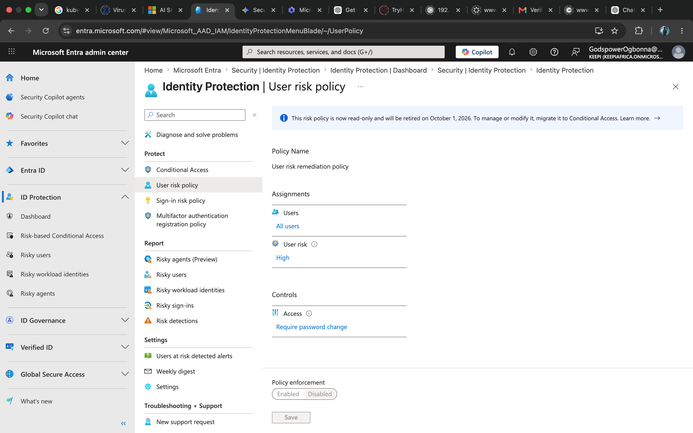
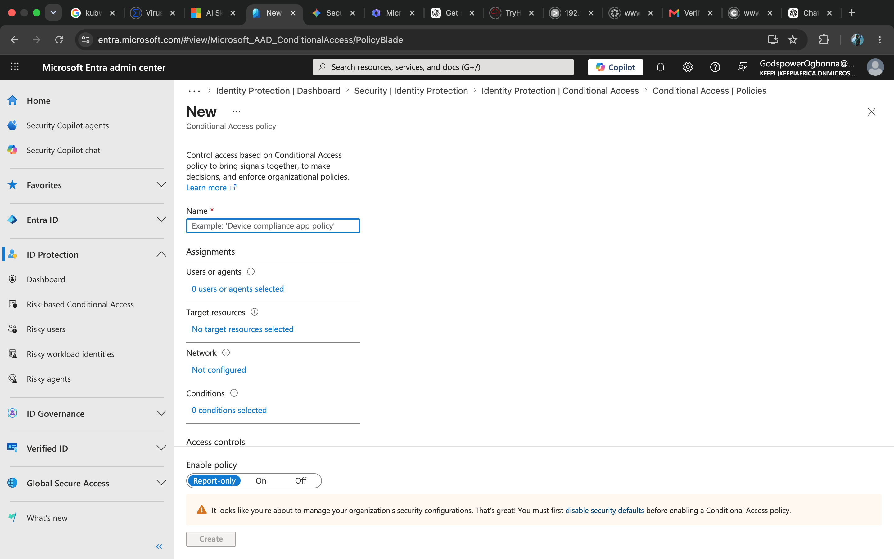
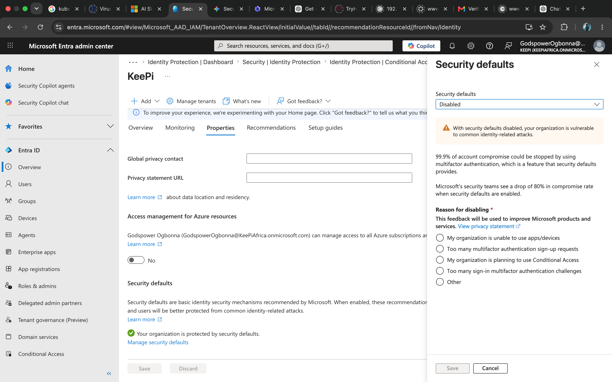
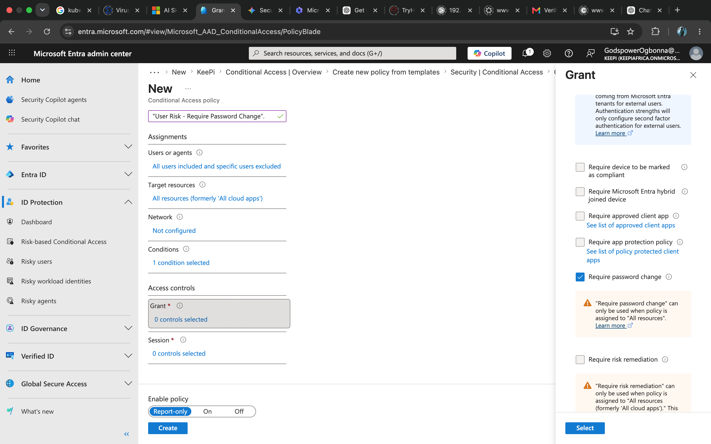

# Configuring Identity Security in Entra ID

DATE & TIME
JUNE 9 | 10:00PM

> *The objective of this project is to migrate legacy identity protection settings to modern **Conditional Access** policies to enforce robust risk-based authentication and mitigation. This project replaces the deprecated "Security defaults" with granular, customizable security controls.*

### Environment Prerequisites

- **Platform:** Microsoft Entra admin center.

> - **Status:** Security defaults were been disallowed for custom policy creation. This is due to a recent update on the MIcrosoft Entra software. Hence we had to move our user risk policy settings to “Conditional Access” pane.

### 3. Configuration Workflow

#### A. Disabling Security Defaults

> we had to disable our security default configurations as that was the only way to create custom configuration settings

- **Navigation:** Identity > Overview > Properties.
- **Action:** Selected "Manage security defaults" and switched status to **Disabled**.
- **Reason Provided:** "My organization is planning to use Conditional Access".

#### B. Defining the "User Risk - Require Password Change" Policy

- **Policy Name:** User Risk - Require Password Change.
- **Assignments:**
    - **Users:** All users (Global Administrator excluded as a break-glass measure).
    - **Target Resources:** All resources (formerly 'All cloud apps').
- **Conditions:** User risk set to **High**.
- **Access Controls (Grant):** Require password change.
- **Policy State:** Set to **Report-only** to validate behavior without impacting production users.

### 4. Technical Notes & Troubleshooting

- **Warning Resolution:** When configuring "Require password change," a UI caution may appear stating it requires "All resources." Even if the caution persists, the policy is valid if "All resources" is confirmed in the target assignments.
- **Best Practice for this situation:** Always maintain an excluded administrative "break-glass" account to prevent accidental lockout when applying tenant-wide policies.
