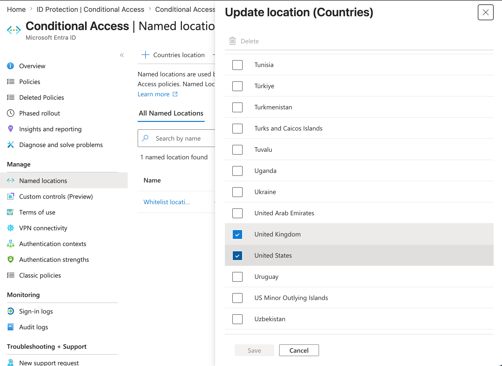
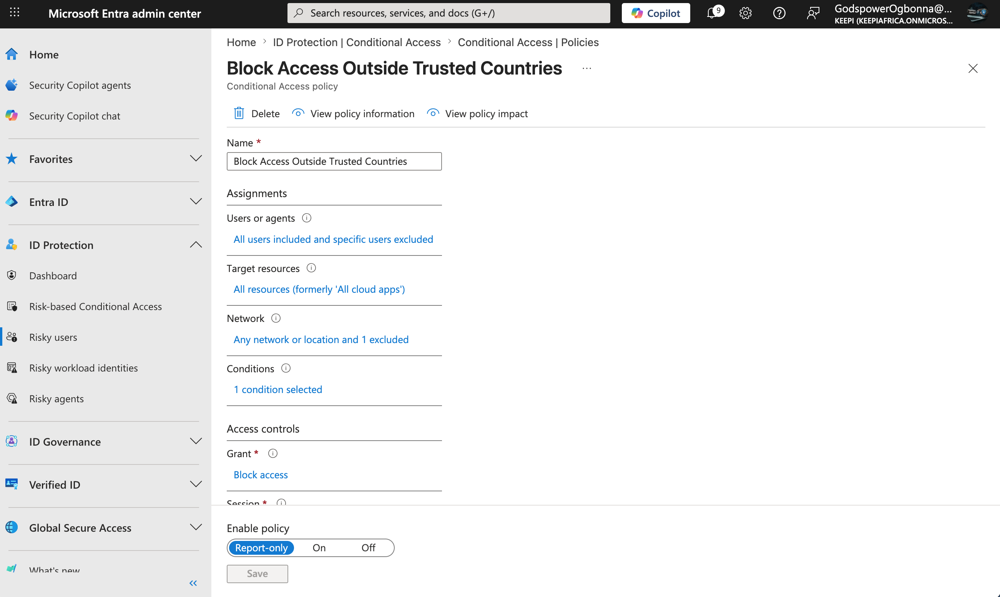

# Microsoft Entra Conditional Access Policy Implementation

> *Design and implement Conditional Access policies that restrict access based on geographic location using Named Locations and Report-only mode.*

### Environment

- Microsoft Entra ID
- Microsoft Learning Sandbox
- Conditional Access
- Named Locations
- Identity Protection

---

### Scenario

Suppose an organization only operates in:

- Nigeria
- Ghana
- United Kingdom
- United States

The goal is to prevent unauthorized access attempts originating from any other country.

---

### Implementation

#### Step 1

Created a Named Location called:

```
Whitelist Locations
```

Countries included:

- Nigeria
- Ghana
- United Kingdom
- United States



---

#### Step 2

Created a Conditional Access policy:

```
Block Access Outside Trusted Countries
```



---

#### Step 3

Configured:

Users

```
All Users
```

(Targeting all users while excluding emergency accounts in a production scenario.)

---

#### Step 4

Resources

```
All Cloud Apps
```

---

#### Step 5

Configured Location Conditions

```
Include:
Any Location

Exclude:
Whitelist Locations
```

---

#### Step 6

Grant Control

```
Block Access
```

---

#### Step 7

Policy State

```
Report-only
```

---

### Security Rationale

Instead of blocking a predefined list of countries, a whitelist approach follows the **principle of least privilege** by allowing access only from countries where the organization operates. This aligns with **Zero Trust** principles because any location outside the trusted list is treated as untrusted by default.

---

### Result

Successfully implemented a Conditional Access policy that would:

- evaluate all sign-ins
- exempt trusted countries
- block access from non-trusted countries
- operate safely in Report-only mode for testing

---

### Skills Demonstrated

- Microsoft Entra ID
- Conditional Access
- Named Locations
- Zero Trust
- Geographic Access Control
- Identity Protection
- Policy Simulation
- Access Governance

---
