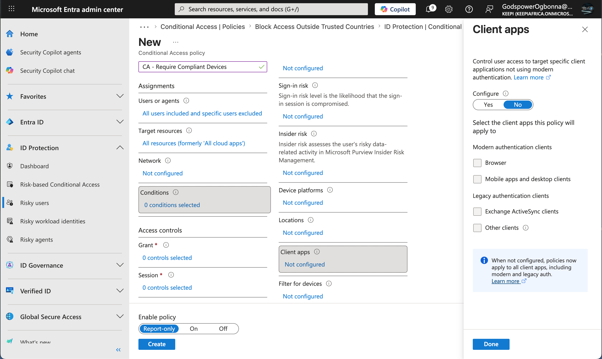
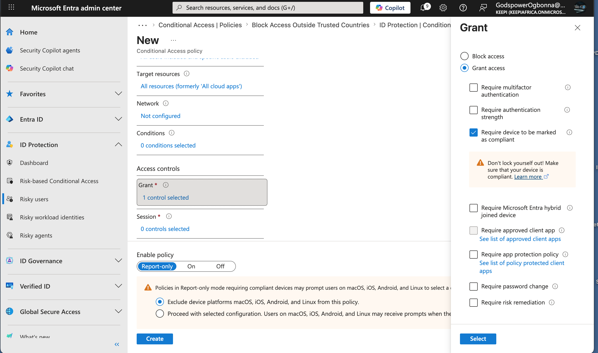
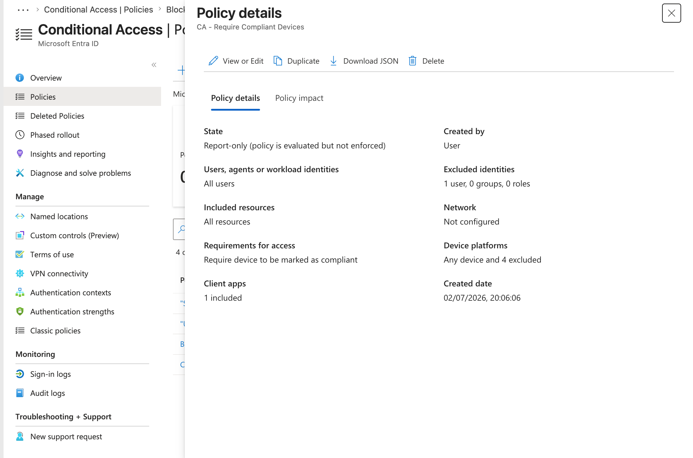

# Implementing a Device Compliance Conditional Access Policy

> Implement a Microsoft Entra Conditional Access policy that only grants access to organizational resources when users sign in from devices that comply with the organization's security requirements.

### Background

One of the core principles of the **Zero Trust** security model is to verify not only the user's identity but also the security posture of the device being used to access organizational resources.

A compromised or unmanaged device can expose corporate data even when the user successfully authenticates. To reduce this risk, Microsoft Entra integrates with Microsoft Intune to evaluate device compliance before granting access.

---

### Environment

| Component | Value |
| --- | --- |
| Identity Provider | Microsoft Entra ID |
| Security Feature | Conditional Access |
| Device Management | Microsoft Intune (Compliance Evaluation) |
| Policy Mode | Report-only |
| Lab Environment | Microsoft Learning Sandbox |

---

## Security Scenario

The objective was to ensure that users could only access Microsoft cloud applications if their device met the organization's compliance requirements.

Typical compliance requirements include:

- Device encryption enabled
- Operating system supported
- Antivirus installed and healthy
- Device enrolled in Microsoft Intune
- Security baseline applied

Instead of blocking all users, the policy grants access **only when the device is compliant**.

---

## Configuration Steps

#### Step 1 — Create a New Conditional Access Policy

Created a new Conditional Access policy named:

```
CA - Require Compliant Devices
```



---

#### Step 2 — Configure Assignments

Configured the following assignments:

**Users**

- Included:
    - All Users

*(In a production environment, emergency "break-glass" administrator accounts should be excluded.)*

---

#### Step 3 — Configure Target Resources

Selected:

- All Cloud Apps

This ensures every Microsoft cloud application is protected by the policy.

---

#### Step 4 — Client Applications

The Client Apps condition was left **Not Configured**.

This allows the policy to apply across supported client applications without restricting it to specific authentication methods.

---

#### Step 5 — Configure Grant Controls

Selected:

**Grant Access**

Configured the following control:

- Require device to be marked as compliant

This ensures that access is granted only when Microsoft Entra verifies that the device satisfies organizational compliance policies.

---

#### Step 6 — Enable Policy

Configured the policy in:

**Report-only**

This allows administrators to observe how the policy would affect users before enforcing it in production.



---

## Policy Logic

```
User signs in
        │
        ▼
Authentication succeeds
        │
        ▼
Evaluate device compliance
        │
    ┌───────────────┐
    │               │
Compliant      Not Compliant
    │               │
    ▼               ▼
Grant Access    Access Denied
```

---

## Result

Successfully implemented a Conditional Access policy that:

- Protected all Microsoft cloud applications.
- Evaluated device compliance before granting access.
- Used Microsoft Entra's Conditional Access engine to enforce device trust.
- Operated safely in **Report-only** mode to validate the policy prior to enforcement.



---

## Skills Demonstrated

- Microsoft Entra ID
- Conditional Access
- Device Compliance
- Microsoft Intune Integration
- Zero Trust Security
- Identity and Access Management (IAM)
- Cloud Access Control
- Policy-Based Access Management

---

## Lessons Learned

This exercise demonstrated that authentication alone is not sufficient to secure cloud resources. Modern IAM solutions evaluate multiple security signals—including identity, location, device posture, and risk level—before making an access decision.

By requiring compliant devices, organizations reduce the risk of compromised or unmanaged endpoints accessing sensitive corporate data.

---
