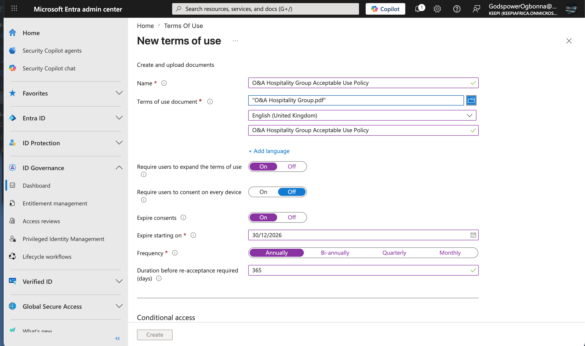
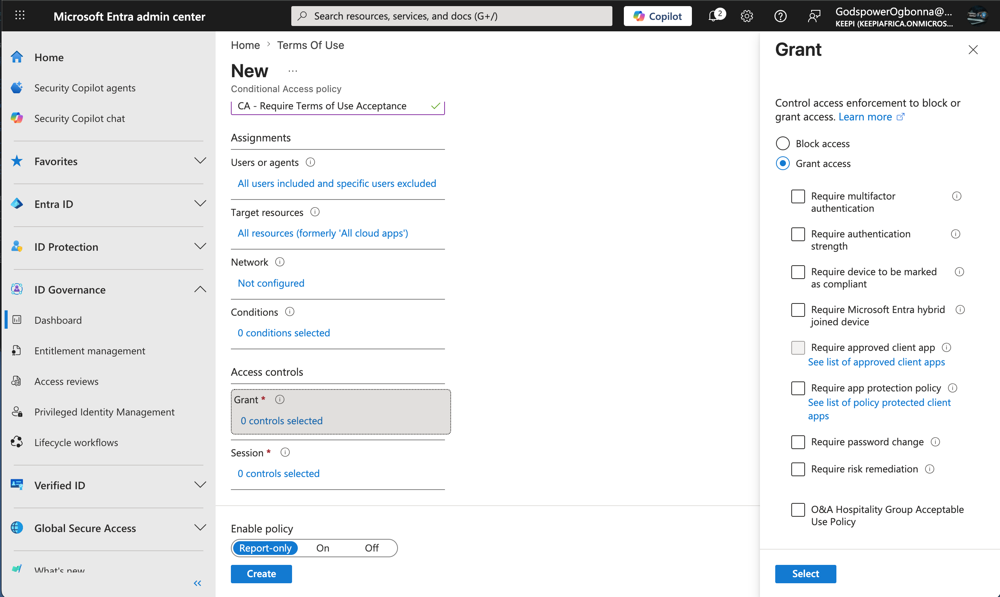
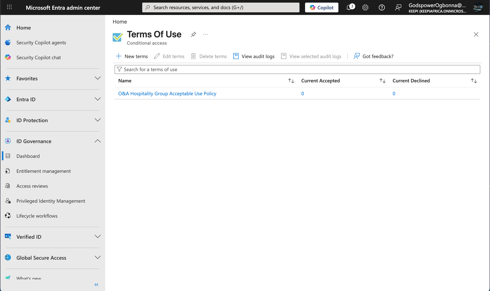

# Implementing Terms of Use Enforcement with Microsoft Entra ID

> *This project demonstrates the implementation of **Microsoft Entra Identity Governance Terms of Use (ToU)** integrated with **Conditional Access**. The objective was to ensure that users acknowledge and accept the organization's Acceptable Use Policy (AUP) before accessing enterprise cloud resources.*
>
> *By enforcing policy acceptance at sign-in, organizations improve compliance, establish user accountability, and maintain an auditable record of policy acceptance.*

## Objectives

- Create a corporate Acceptable Use Policy (AUP).
- Upload the policy into Microsoft Entra Identity Governance.
- Configure Terms of Use settings.
- Require users to accept the policy before accessing cloud applications.
- Generate an auditable acceptance record.
- Demonstrate governance and compliance capabilities within Microsoft Entra.

---

## Environment

| Component | Details |
| --- | --- |
| Identity Platform | Microsoft Entra ID |
| Feature | Identity Governance |
| Security Control | Terms of Use |
| Access Control | Conditional Access |
| Test Tenant | KeePi |
| Policy Document | O&A Hospitality Group Acceptable Use Policy |

---

## Security Scenario

Many organizations require employees to acknowledge corporate security policies before accessing company resources.

Rather than distributing policies through email and relying on manual signatures, Microsoft Entra integrates Terms of Use with Conditional Access, ensuring users must review and accept organizational policies during authentication.

---

## Implementation Steps

### Step 1 – Draft Acceptable Use Policy

A custom Acceptable Use Policy (AUP) was developed for **O&A Hospitality Group**.

The policy included:

- Acceptable use of company systems
- Password and authentication requirements
- Data protection responsibilities
- Prohibited activities
- Security monitoring notice
- Policy violation consequences
- User acknowledgement section

---

### Step 2 – Upload Terms of Use Document

Navigated to:

**Microsoft Entra Admin Center → Identity Governance → Terms of Use**

Configured:

| Setting | Value |
| --- | --- |
| Policy Name | O&A Hospitality Group Acceptable Use Policy |
| Language | English (United Kingdom) |
| Display Name | O&A Hospitality Group Acceptable Use Policy |
| Document | O&A Hospitality Group.pdf |

**Result**

The organizational Acceptable Use Policy was successfully uploaded into Microsoft Entra Identity Governance.

---

### Step 3 – Configure User Consent Settings

The following governance settings were configured:

| Setting | Configuration |
| --- | --- |
| Require users to expand Terms of Use | Enabled |
| Require consent on every device | Disabled |
| Expire consent | Enabled |
| Reacceptance Frequency | Annually |
| Reacceptance Interval | 365 Days |

These settings ensure users actively review the document and periodically reaffirm their acceptance.

---

### Step 4 – Integrate with Conditional Access

A new Conditional Access policy was created to enforce Terms of Use acceptance.

#### Policy Configuration

| Setting | Value |
| --- | --- |
| Policy Name | CA – Require Terms of Use Acceptance |
| Users | All Users (Administrator Excluded) |
| Target Resources | All Cloud Applications |
| Grant Control | Grant Access |
| Requirement | O&A Hospitality Group Acceptable Use Policy |
| Policy Mode | Report-only |

Instead of requiring MFA or blocking access, the Grant control was configured to require acceptance of the uploaded Terms of Use before granting access.

---

### Step 5 – Verify Deployment

After creation, the Terms of Use dashboard confirmed successful deployment.

Initial statistics showed:

| Metric | Value |
| --- | --- |
| Current Accepted | 0 |
| Current Declined | 0 |

This is expected because no users had yet authenticated through the policy.

Administrators can later monitor:

- Accepted users
- Declined users
- Acceptance timestamps
- Audit logs
- Document version history

---

## Security Benefits

This implementation provides several governance and compliance benefits:

- Enforces acknowledgment of organizational security policies.
- Creates legally defensible records of policy acceptance.
- Reduces disputes regarding acceptable system usage.
- Supports regulatory and compliance requirements.
- Automates policy reacceptance on a recurring schedule.
- Integrates policy enforcement directly into the authentication process.

---

## Skills Demonstrated

- Microsoft Entra ID
- Microsoft Entra Identity Governance
- Conditional Access
- Terms of Use Policies
- Governance & Compliance
- Identity Security Administration
- Access Policy Design
- Security Policy Enforcement

---

### Conclusion

This project successfully implemented a **Terms of Use enforcement solution** using Microsoft Entra Identity Governance and Conditional Access. Users can now be required to review and accept the organization's Acceptable Use Policy before accessing cloud applications, while administrators maintain a centralized, auditable record of user acknowledgments.
