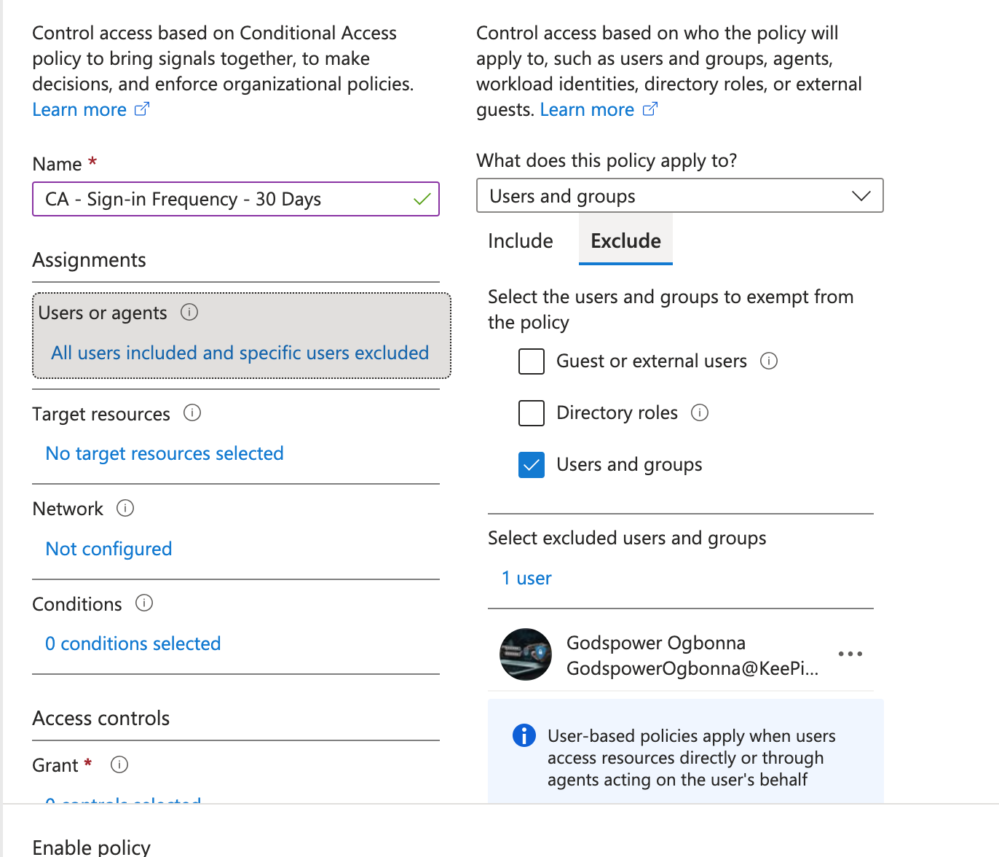
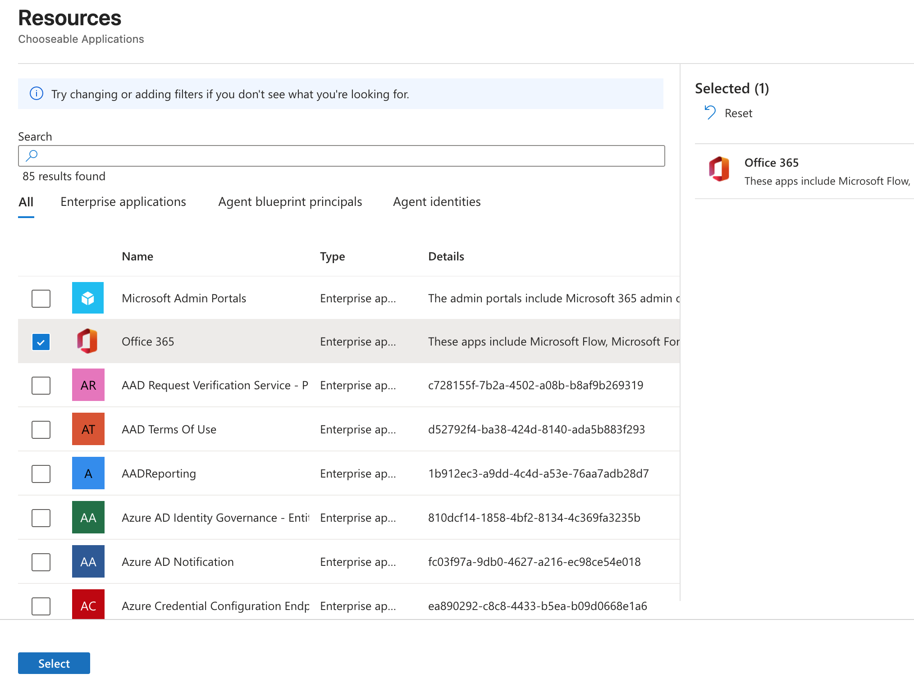
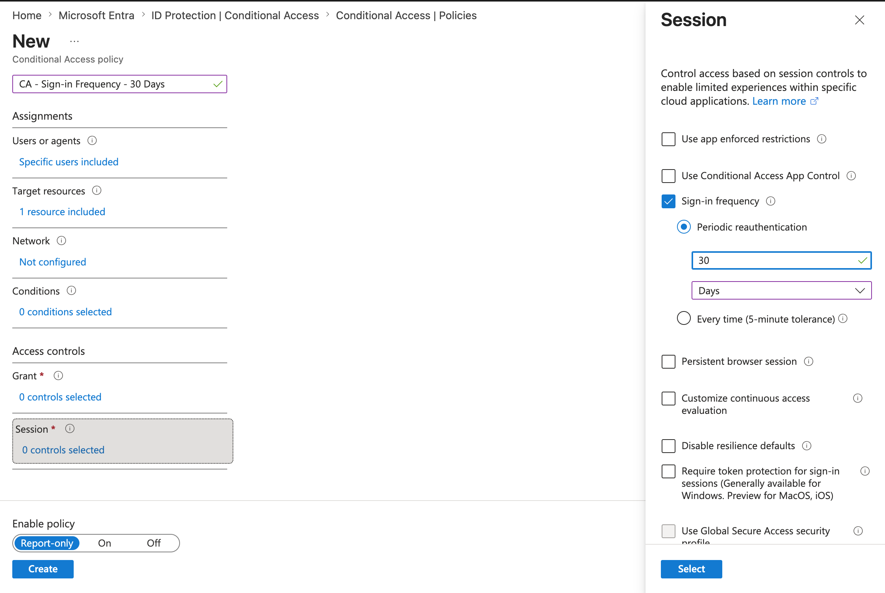
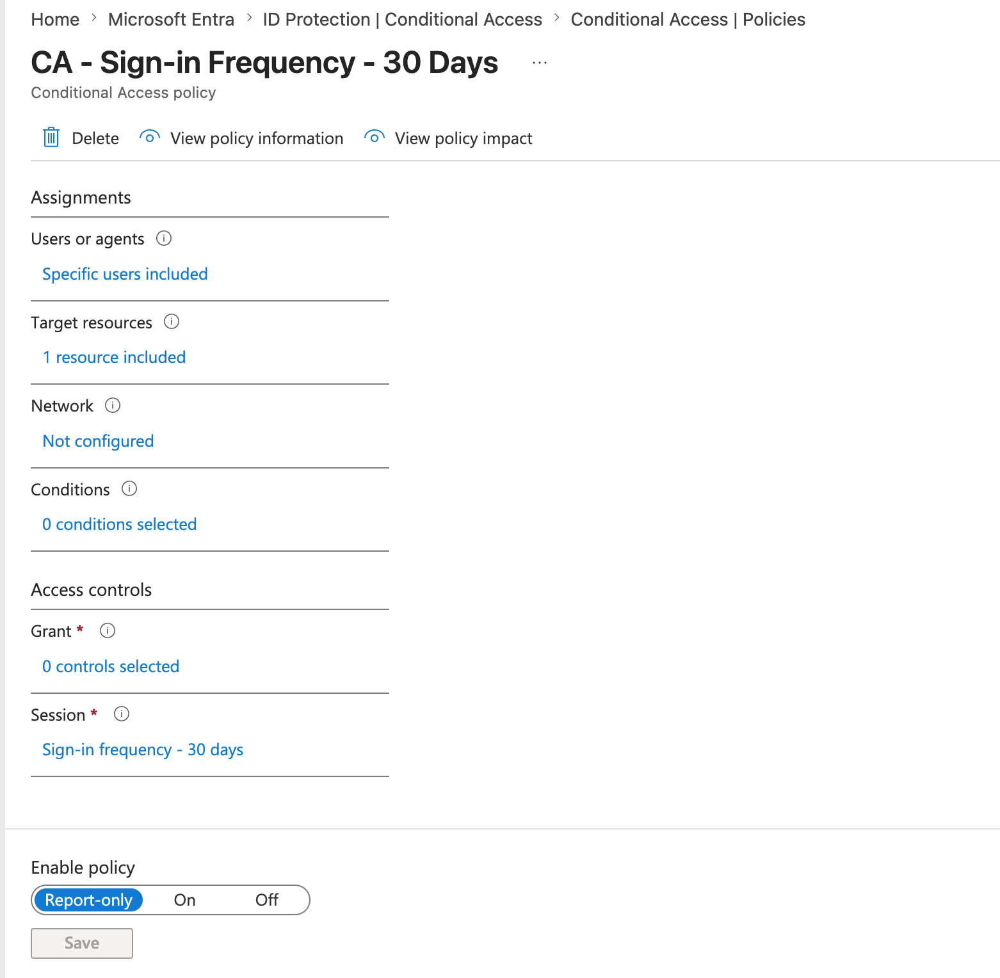

# Configure Sign-in Frequency Using Microsoft Entra Conditional Access

> *To configure a Microsoft Entra Conditional Access policy that requires users to re-authenticate every **30 days** when accessing Microsoft 365 applications. The policy was deployed in **Report-only** mode to safely validate its impact before enforcement.*

## Business Scenario

Organizations often allow employees to remain signed in to Microsoft 365 applications for extended periods. While this improves productivity, long-lived authentication sessions increase security risks if a device is lost, stolen, or compromised.

To reduce this risk, organizations implement **Sign-in Frequency** policies that periodically require users to prove their identity again.

In this project, a Conditional Access policy was created to require re-authentication every **30 days** for Microsoft 365 applications.

---

## Objectives

- Configure a Conditional Access Session policy.
- Apply the policy to a specific user.
- Target Microsoft 365 resources only.
- Configure a 30-day sign-in frequency.
- Deploy the policy safely using Report-only mode.

---

## Why Sign-in Frequency?

Authentication tokens can remain valid for long periods while applications silently refresh them.

Although convenient, this increases the amount of time an attacker could potentially use an already authenticated session.

Sign-in Frequency reduces this risk by periodically forcing users to authenticate again.

Example:

```
Day 1
↓

User signs into Outlook

↓

Access token refreshed automatically

↓

Day 30

↓

User must authenticate again

↓

New authentication session begins
```

This balances usability with security.

---

## Configuration Steps

### Step 1 – Create a New Conditional Access Policy

Navigate to:

```
Microsoft Entra Admin Center

↓

Identity

↓

Protection

↓

Conditional Access

↓

New Policy
```

Policy Name:

```
CA - Sign-in Frequency - 30 Days
```

---

### Step 2 – Configure User Assignments

Selected:

```
Users and Groups

↓

Specific Users

↓

Administrator Account
```



---

### Step 3 – Configure Target Resources

Selected:

```
Resources (Cloud Apps)

↓

Select Resources

↓

Office 365
```

#### Why?

The policy only affects Microsoft 365 services such as:

- Outlook
- Teams
- OneDrive
- SharePoint
- Exchange Online



---

### Step 4 – Configure Session Controls

Navigate to:

```
Access Controls

↓

Session

↓

Sign-in Frequency
```

Configuration:

| Setting | Value |
| --- | --- |
| Frequency | 30 |
| Unit | Days |

### 



---

### Step 5 – Enable Report-only Mode

Selected:

```
Report-only
```

instead of

```
On
```



---

## Security Benefits

Implementing Sign-in Frequency provides several security improvements:

- Limits the lifetime of authenticated sessions.
- Reduces the risk associated with stolen or unattended devices.
- Forces periodic identity verification.
- Supports Zero Trust by continuously validating user identity.
- Improves control over access to Microsoft 365 resources.

---

## Skills Demonstrated

- Microsoft Entra ID Administration
- Conditional Access Configuration
- Session Management
- Identity Security
- Authentication Lifecycle Management
- Microsoft 365 Security
- Zero Trust Access Controls
- IAM Policy Design
- Secure Policy Deployment using Report-only Mode

---

## Key Lessons Learned

- Session controls govern user behavior **after** successful authentication.
- Sign-in Frequency reduces the lifetime of trusted sessions without constantly interrupting users.
- Report-only mode is a best practice for validating Conditional Access policies before enforcement.
- Scoping policies to specific users and resources minimizes operational risk during testing.
- Conditional Access separates **Grant Controls** (who gets access) from **Session Controls** (how access is maintained), enabling more granular security policies.
